# Deciphering Motion in Visual Dynamics: A Comprehensive Survey

## Full list

### Quick Links

- [Motion Estimation](#Motion Estimation)
  - [Estimation by Prediction](#Estimation by Prediction)
    - [Physics-Based Methods](#Physics-Based Methods)
    - [Sequential Modeling Networks](#Sequential Modeling Networks)
    - [Generative Models](#Generative Models)
  - [Estimation by Correlation](#Estimation by Correlation)
    - [Explicit Computation](#Explicit Computation)
    - [Two-Stream Architecture](#Two-Stream Architecture)
    - [Attention Mechanism](#Attention Mechanism)
    - [Implicit Learning](#Implicit Learning)
  - [Practical Strategies](#Practical Strategies)
    - [Iterative Refinement](#Iterative Refinement)
    - [Memory Augmentation](#Memory Augmentation)
    - [Online Update](#Online Update)
- [Motion Understanding](#Motion Understanding)
  - [Motion-Separated Modeling](#Motion-Separated Modeling)
    - [Intra-Block Separated Modeling](#Intra-Block Separated Modeling)
    - [Parallel Inter-Block Separated Modeling](#Parallel Inter-Block Separated Modeling)
    - [Sequential Inter-Block Separated Modeling](#Sequential Inter-Block Separated Modeling)
  - [Motion-Joint Modeling](#Motion-Joint Modeling)
    - [Local Operator](#Local Operator)
    - [Global Interaction](#Global Interaction)
    - [Local-Global Mechanism](#Local-Global Mechanism)
    - [LLM-based Modeling](#LLM-based Modeling)
  - [Context-Augmented Modeling](#Context-Augmented Modeling)
    - [Multimodal Fusion](#Multimodal Fusion)
    - [Cross-Modal Alignment](#Cross-Modal Alignment)
    - [Contextual Priors](#Contextual Priors)
- [Motion Generation](#Motion Generation)
  - [Explicit Motion Guidance](#Explicit Motion Guidance)
    - [Input-level Embedding](#Input-level Embedding)
    - [Latent-level Fusion](#Latent-level Fusion)
    - [Architecture-Level Integration](#Architecture-Level Integration)
  - [Implicit Motion Learning](#Implicit Motion Learning)
    - [Input-level Preparation](#Input-level Preparation)
    - [Architectural-level Refinement](#Architectural-level Refinement)
    - [Training Optimization](#Training Optimization)
  - [Practical Strategies](#Practical Strategies)
    - [Dynamic Condition](#Dynamic Condition)
    - [Frequency decomposition](#Frequency decomposition)
    - [Extract motion representation](#Extract motion representation)
    - [Autoregressive Generation](#Autoregressive Generation)

### Motion Estimation

#### Estimation by Prediction

##### Physics-Based Methods
16 17 18 19 20 21 22 23 24 25 26 27 28 29 30 31 32 33 34
| Title & Authors | Introduction | Links |
| ------------- | ------------- | ------------- |
|[An Introduction to the Kalman Filter](https://d1wqtxts1xzle7.cloudfront.net/52484748/Kalman_CoursePack_08-libre.pdf?1491379511=&response-content-disposition=inline%3B+filename%3DAn_Introduction_to_the_Kalman_Filter.pdf&Expires=1750353534&Signature=eCqfwl8yOdlKkJ249wukP8OUaorUeNjMB-SKiEAeqbIMT6EnQRQbx6UZ6jKUCQ5SdCV1CFghv6fNWXHGvduytueZ71b8EPx87Iwdi6CjCh8PZJPCSM47eDjYkJcR81FVMqQaDl9fjs50y1LlEN2HT6DwH4pc2ykGe3VdRdBNO7Cxs9mujCMeLu76RrWn53by5MYMI269-mG~k5br6rdhNxI23xFmVt16SceuaOkF3JN8TW3RXpwm7jESpLYovlDq3qTGejKEZ3zVlV5kOXw~wc8ZC9S7xy2bZJ9uF2WAWY0cQVMBal1XIPTqRdO8vpgPEtWOCg011L6mP4IZtC5dEA__&Key-Pair-Id=APKAJLOHF5GGSLRBV4ZA)   Greg Welch1 and Gary Bishop2 | 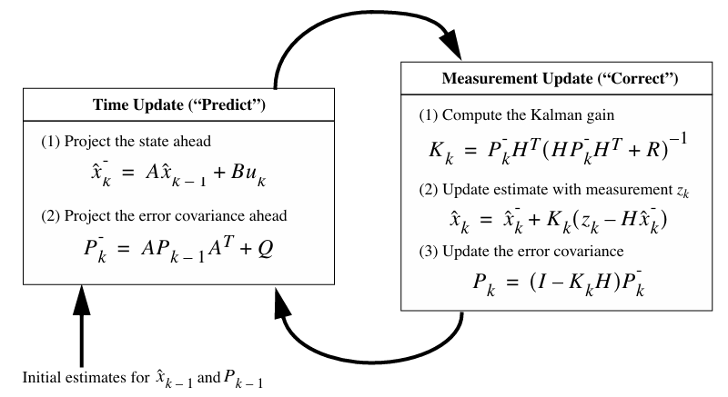 | [Paper](https://d1wqtxts1xzle7.cloudfront.net/52484748/Kalman_CoursePack_08-libre.pdf?1491379511=&response-content-disposition=inline%3B+filename%3DAn_Introduction_to_the_Kalman_Filter.pdf&Expires=1750353534&Signature=eCqfwl8yOdlKkJ249wukP8OUaorUeNjMB-SKiEAeqbIMT6EnQRQbx6UZ6jKUCQ5SdCV1CFghv6fNWXHGvduytueZ71b8EPx87Iwdi6CjCh8PZJPCSM47eDjYkJcR81FVMqQaDl9fjs50y1LlEN2HT6DwH4pc2ykGe3VdRdBNO7Cxs9mujCMeLu76RrWn53by5MYMI269-mG~k5br6rdhNxI23xFmVt16SceuaOkF3JN8TW3RXpwm7jESpLYovlDq3qTGejKEZ3zVlV5kOXw~wc8ZC9S7xy2bZJ9uF2WAWY0cQVMBal1XIPTqRdO8vpgPEtWOCg011L6mP4IZtC5dEA__&Key-Pair-Id=APKAJLOHF5GGSLRBV4ZA) |
| [Simple Online and Realtime Tracking](https://arxiv.org/abs/1602.00763)   Alex Bewley, Zongyuan Ge, Lionel Ott, Fabio Ramos, Ben Upcroft | 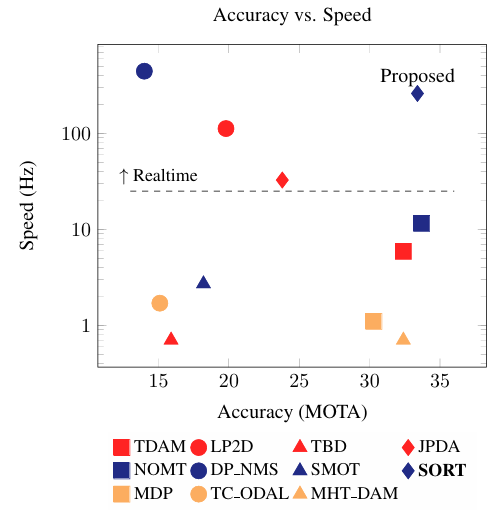 | [Paper](https://arxiv.org/abs/1602.00763) |
| [Simple Online and Realtime Tracking with a Deep Association Metric](https://arxiv.org/abs/1703.07402)   Nicolai Wojke, Alex Bewley, Dietrich Paulus | 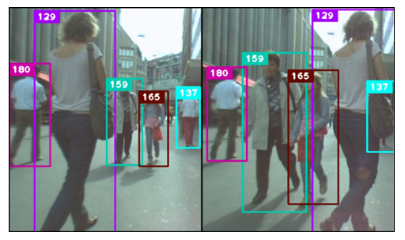 | [Paper](https://arxiv.org/abs/1703.07402) |
| [ByteTrack: Multi-Object Tracking by Associating Every Detection Box](https://arxiv.org/abs/2110.06864)   Yifu Zhang, Peize Sun, Yi Jiang, Dongdong Yu, Fucheng Weng, Zehuan Yuan, Ping Luo, Wenyu Liu, Xinggang Wang | 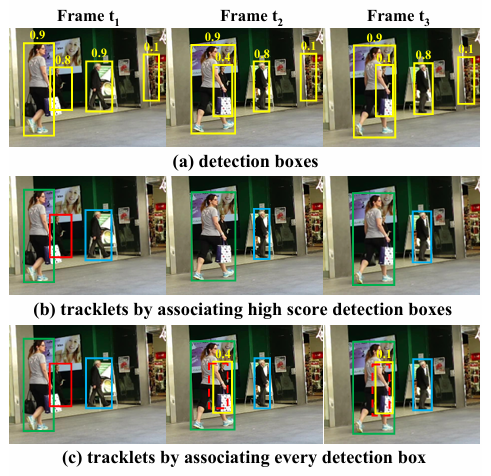 | [GitHub](https://github.com/FoundationVision/ByteTrack)   [Paper](https://arxiv.org/abs/2110.06864) |
| [StrongSORT: Make DeepSORT Great Again](https://arxiv.org/abs/2202.13514)   Yunhao Du, Zhicheng Zhao, Yang Song, Yanyun Zhao, Fei Su, Tao Gong, Hongying Meng | 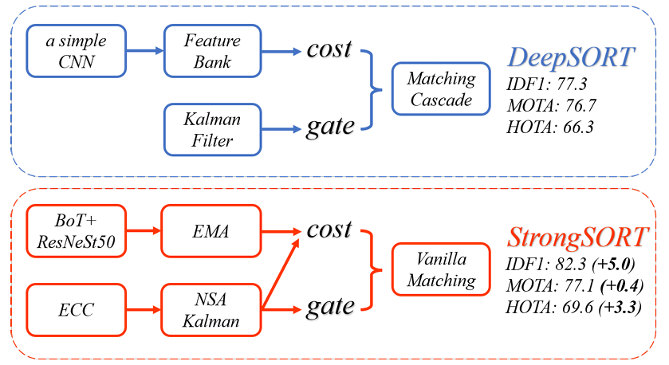 | [GitHub](https://github.com/dyhBUPT/StrongSORT) [GitHub](https://github.com/open-mmlab/mmtracking)   [Paper](https://arxiv.org/abs/2202.13514) |
| [BoT-SORT: Robust Associations Multi-Pedestrian Tracking](https://arxiv.org/abs/2206.14651)   Nir Aharon, Roy Orfaig, Ben-Zion Bobrovsky | 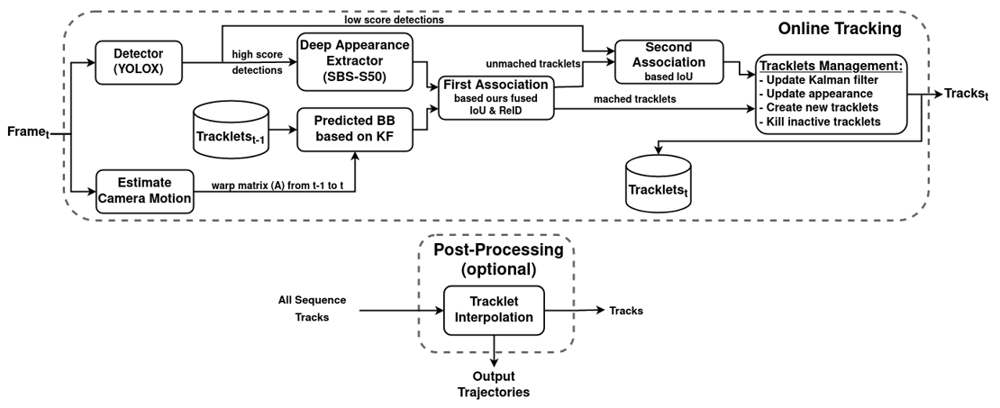 | [GitHub](https://github.com/NirAharon/BOT-SORT)   [Paper](https://arxiv.org/abs/2206.14651) |
| [FeatureSORT: Essential Features for Effective Tracking](https://arxiv.org/abs/2407.04249)   Hamidreza Hashempoor, Rosemary Koikara, Yu Dong Hwang | 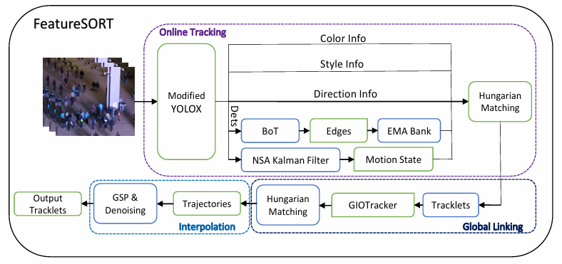 | [Paper](https://arxiv.org/abs/2407.04249) |
| [Hybrid-SORT: Weak Cues Matter for Online Multi-Object Tracking](https://arxiv.org/abs/2308.00783)   Mingzhan Yang, Guangxin Han, Bin Yan, Wenhua Zhang, Jinqing Qi, Huchuan Lu, Dong Wang  | 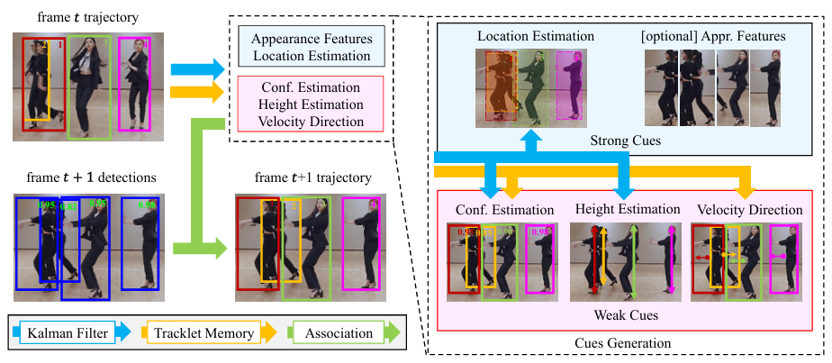 | [GitHub](https://github.com/ymzis69/HybridSORT)   [Paper](https://arxiv.org/abs/2308.00783) |
| [Faster R-CNN: Towards Real-Time Object Detection with Region Proposal Networks](https://arxiv.org/abs/1506.01497)   Shaoqing Ren, Kaiming He, Ross Girshick, Jian Sun | 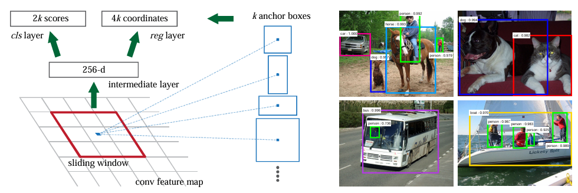 | [Paper](https://arxiv.org/abs/1506.01497) |
| [YOLOX: Exceeding YOLO Series in 2021](https://arxiv.org/abs/2107.08430)   Zheng Ge, Songtao Liu, Feng Wang, Zeming Li, Jian Sun | 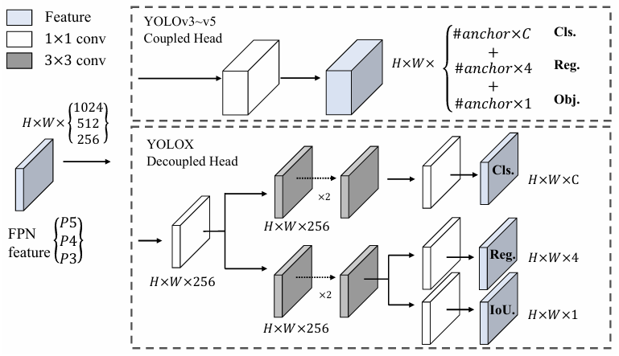 | [GitHub](https://github.com/Megvii-BaseDetection/YOLOX)   [Paper](https://arxiv.org/abs/2107.08430) |
| [The Hungarian method for the assignment problem](https://onlinelibrary.wiley.com/doi/abs/10.1002/nav.3800020109)   H. W. Kuhn | 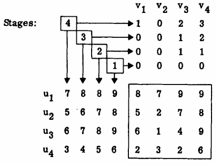 | [Paper](https://www.math.toronto.edu/mccann/1855/KuhnNRL55.pdf) |
| [KalmanFlow 2.0: Efficient Video Optical Flow Estimation via Context-Aware Kalman Filtering](https://ieeexplore.ieee.org/document/8662710)   Wenbo Bao; Xiaoyun Zhang; Li Chen; Zhiyong Gao | 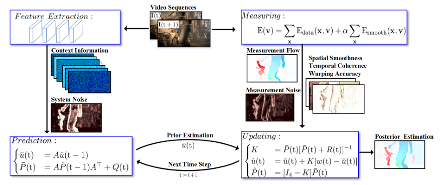 | [Paper](https://ieeexplore.ieee.org/document/8662710) |
| [Particle Filters for Multiple Target Tracking](https://www.sciencedirect.com/science/article/pii/S2212017316303061)   Rooji Jinan, Tara Raveendran | 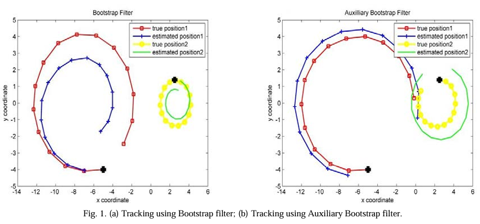 | [Paper](https://www.sciencedirect.com/science/article/pii/S2212017316303061) |
| [Tracking in Low Frame Rate Video: A Cascade Particle Filter with Discriminative Observers of Different Lifespans](http://vigir.missouri.edu/~gdesouza/Research/Conference_CDs/IEEE_CVPR_2007/data/papers/0231.pdf#:~:text=In%20this%20paper%2C%20we%20address%20the%20problem%20from,probabilistic%20combination%20of%20dis-criminative%20observers%20of%20different%20lifespans.)   Yuan Li; Haizhou Ai; Takayoshi Yamashita; Shihong Lao; Masato Kawade | 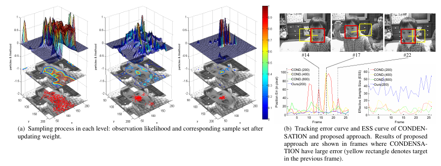 | [Paper](http://vigir.missouri.edu/~gdesouza/Research/Conference_CDs/IEEE_CVPR_2007/data/papers/0231.pdf#:~:text=In%20this%20paper%2C%20we%20address%20the%20problem%20from,probabilistic%20combination%20of%20dis-criminative%20observers%20of%20different%20lifespans.) |
| [Sequential Monte Carlo tracking by fusing multiple cues in video sequences Author links open overlay panel](https://www.sciencedirect.com/science/article/abs/pii/S0262885606002277)   Paul Brasnett, Lyudmila Mihaylova, David Bull, Nishan Canagarajah | 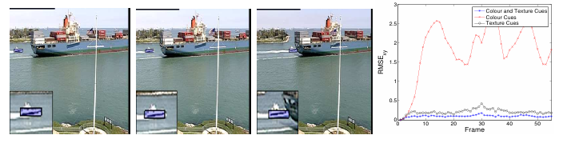 | [Paper](https://www.sciencedirect.com/science/article/abs/pii/S0262885606002277) |
| [Occluded object tracking using object-background prototypes and particle filter](https://dl.acm.org/doi/10.1007/s10489-020-02047-x)   Ajoy Mondal | 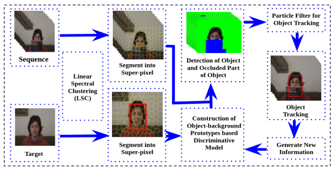 | [Paper](https://dl.acm.org/doi/10.1007/s10489-020-02047-x) |
| [Color-Based Probabilistic Tracking](https://dl.acm.org/doi/10.5555/645315.649166)   Patrick Pérez, Carine Hue, Jaco Vermaak, Michel Gangnet | 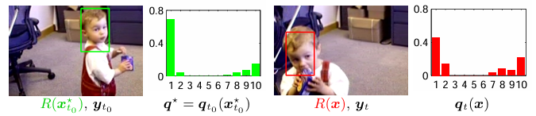 | [Paper](https://dl.acm.org/doi/10.5555/645315.649166) |
| [Object tracking algorithm based on particle filter with color and texture feature](https://ieeexplore.ieee.org/abstract/document/7553983)   Dongsheng Ding; Zengru Jiang; Chengyuan Liu | 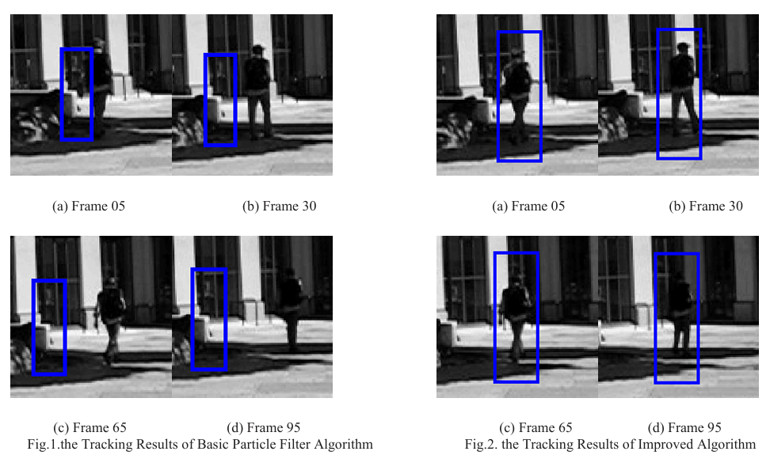 | [Paper](https://ieeexplore.ieee.org/abstract/document/7553983) |
| [Robust visual tracking based on variational auto-encoding Markov chain Monte Carlo](https://www.sciencedirect.com/science/article/abs/pii/S0020025519308618)   Junseok Kwon | 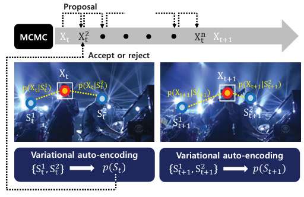 | [Paper](https://www.sciencedirect.com/science/article/abs/pii/S0020025519308618) |

##### Sequential Modeling Networks
35 36 37 38 39 40 41 42 43 44 45 46 47 48 49 
| Title & Authors | Introduction | Links |
| ------------- | ------------- | ------------- |
| [Recurrent Filter Learning for Visual Tracking](https://ieeexplore.ieee.org/document/8265445)   Tianyu Yang; Antoni B. Chan | 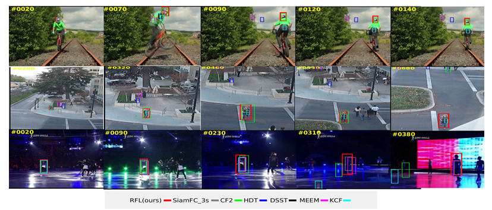 | [Paper](https://ieeexplore.ieee.org/document/8265445) |
| [Cooperative Use of Recurrent Neural Network and Siamese Region Proposal Network for Robust Visual Tracking](https://ieeexplore.ieee.org/document/9400810)   Xuechen Zhao; Yaoming Liu; Guang Han | 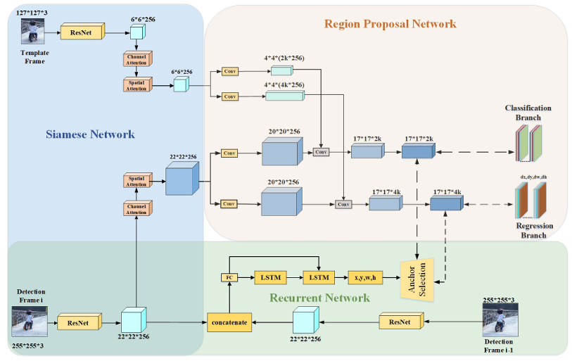 | [Paper](https://ieeexplore.ieee.org/document/9400810) |
| [Attention-Driven Memory Network for Online Visual Tracking](https://ieeexplore.ieee.org/document/10215054)   Huanlong Zhang; Jiamei Liang; Jiapeng Zhang; Tianzhu Zhang; Yingzi Lin; Yanfeng Wang | 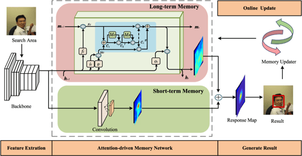 | [Paper](https://ieeexplore.ieee.org/document/10215054) |
| [Learning Dynamic Memory Networks for Object Tracking](https://arxiv.org/abs/1803.07268)   Tianyu Yang, Antoni B. Chan | 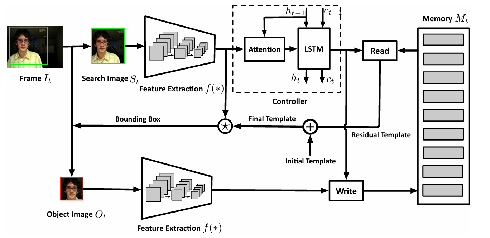 | [Paper](https://arxiv.org/abs/1803.07268) |
| [Visual Tracking via Dynamic Memory Networks](https://arxiv.org/abs/1907.07613)   Tianyu Yang, Antoni B. Chan | 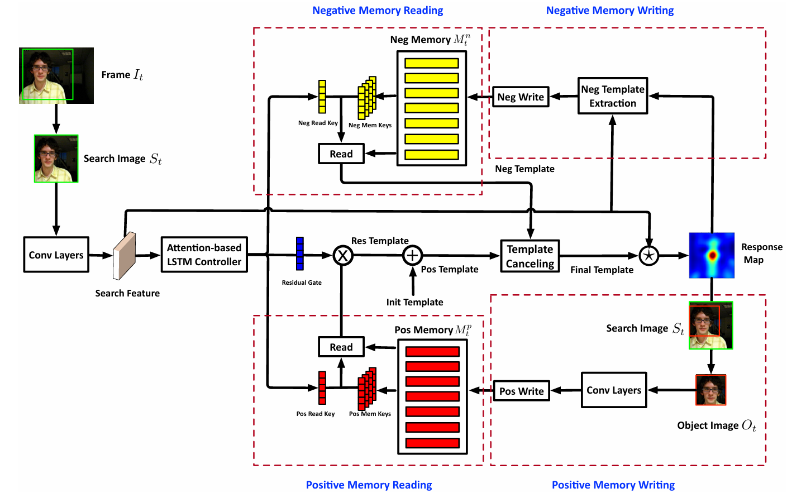 | [Paper](https://arxiv.org/abs/1907.07613) |
| [Object Tracking Using Spatio-Temporal Future Prediction](https://arxiv.org/abs/2010.07605)   Yuan Liu, Ruoteng Li, Robby T. Tan, Yu Cheng, Xiubao Sui |  | [Paper](https://arxiv.org/abs/2010.07605) |
| [RAFT: Recurrent All-Pairs Field Transforms for Optical Flow](https://arxiv.org/abs/2003.12039)   Zachary Teed, Jia Deng | 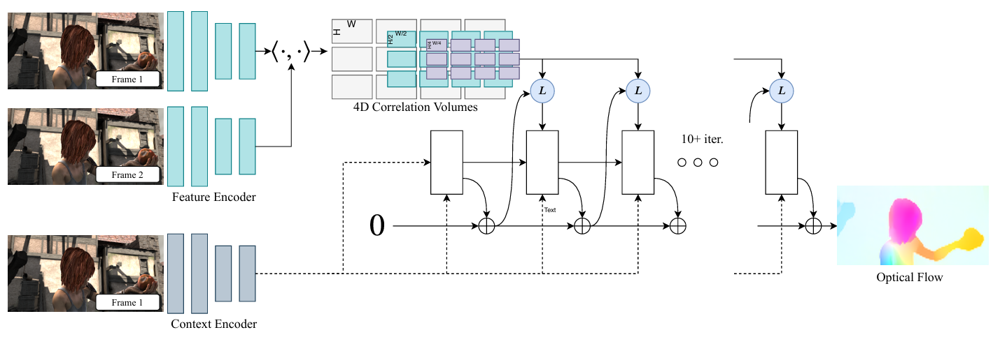 | [GitHub](https://github.com/princeton-vl/RAFT)   [Paper](https://arxiv.org/abs/2003.12039) |
| [An Image is Worth 16x16 Words: Transformers for Image Recognition at Scale](https://arxiv.org/abs/2010.11929)   Alexey Dosovitskiy, Lucas Beyer, Alexander Kolesnikov, Dirk Weissenborn, Xiaohua Zhai, Thomas Unterthiner, Mostafa Dehghani, Matthias Minderer, Georg Heigold, Sylvain Gelly, Jakob Uszkoreit, Neil Houlsby | 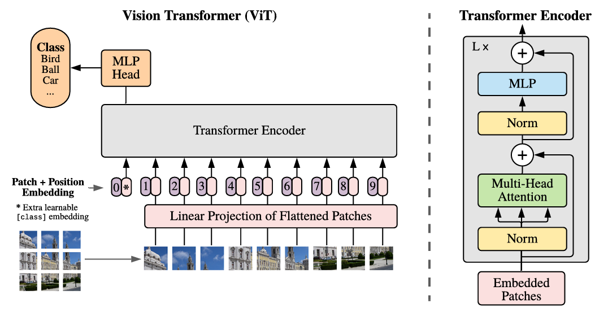 | [Paper](https://arxiv.org/abs/2010.11929) |
| [SeqTrack: Sequence to Sequence Learning for Visual Object Tracking](https://ieeexplore.ieee.org/document/10203645)   Xin Chen; Houwen Peng; Dong Wang; Huchuan Lu; Han Hu | 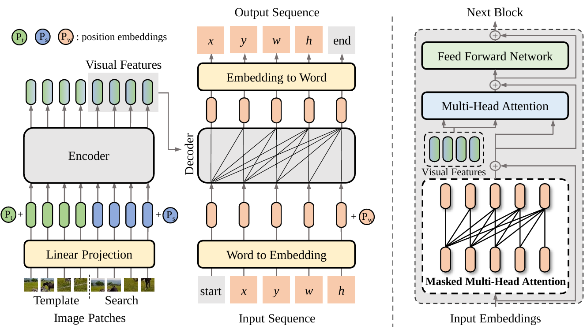 | [GitHub](https://github.com/microsoft/VideoX)   [Paper](https://ieeexplore.ieee.org/document/10203645) |
| [Is a Pure Transformer Effective for Separated and Online Multi-Object Tracking?](https://arxiv.org/abs/2405.14119)   Chongwei Liu, Haojie Li, Zhihui Wang, Rui Xu | 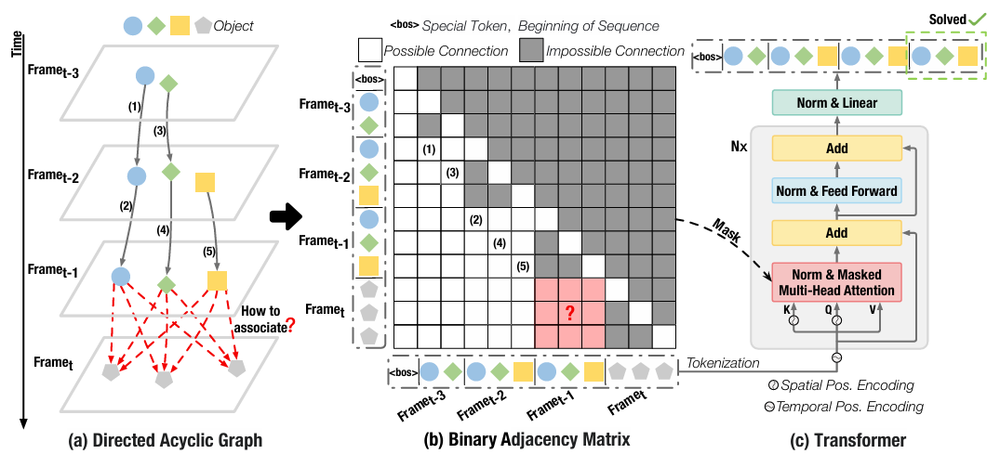 | [GitHub](https://github.com/chongweiliu/PuTR)   [Paper](https://arxiv.org/abs/2405.14119) |
| [FlowFormer: A Transformer Architecture for Optical Flow](https://arxiv.org/abs/2203.16194)   Zhaoyang Huang, Xiaoyu Shi, Chao Zhang, Qiang Wang, Ka Chun Cheung, Hongwei Qin, Jifeng Dai, Hongsheng Li | 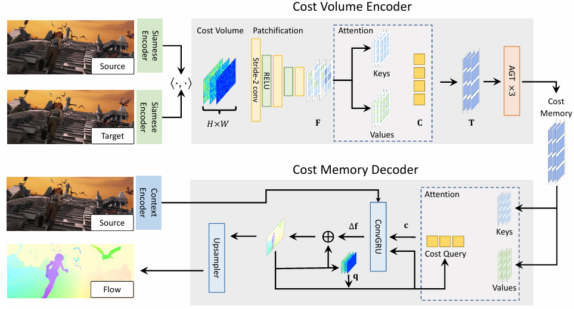 | [Paper](https://arxiv.org/abs/2203.16194) |
| [TransFlow: Transformer as Flow Learner](https://arxiv.org/abs/2304.11523)   Yawen Lu, Qifan Wang, Siqi Ma, Tong Geng, Yingjie Victor Chen, Huaijin Chen, Dongfang Liu | 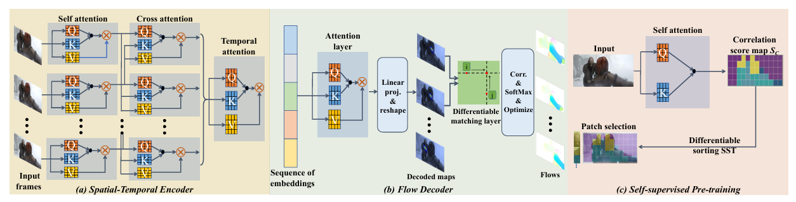 | [Paper](https://arxiv.org/abs/2304.11523) |
| [Mamba: Linear-Time Sequence Modeling with Selective State Spaces](https://arxiv.org/abs/2312.00752)   Albert Gu, Tri Dao | 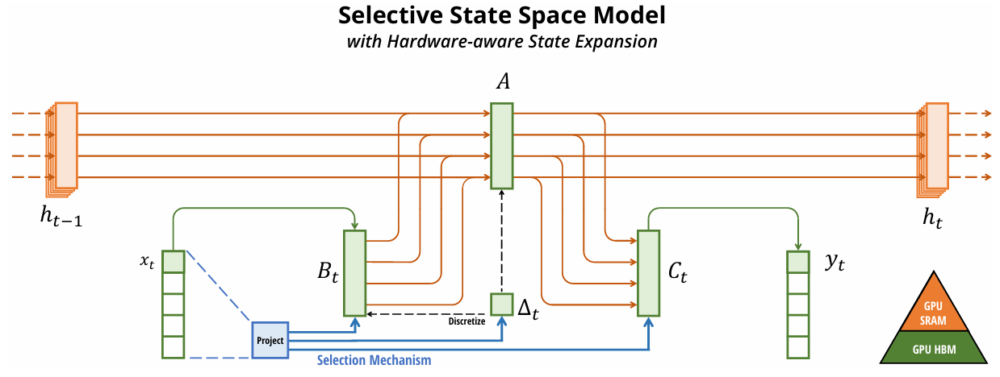 | [Paper](https://arxiv.org/abs/2312.00752) |
| [TrackSSM: A General Motion Predictor by State-Space Model](https://arxiv.org/abs/2409.00487)   Bin Hu, Run Luo, Zelin Liu, Cheng Wang, Wenyu Liu | 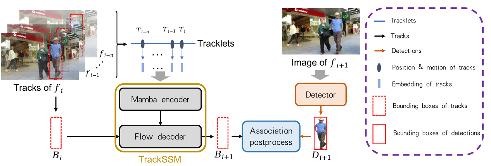 | [GitHub](https://github.com/Xavier-Lin/TrackSSM)   [Paper](https://arxiv.org/abs/2409.00487) |
| [DSTrack: Diffusion-based sequence learning for visual object tracking](https://www.sciencedirect.com/science/article/abs/pii/S0031320325003541#:~:text=In%20this%20paper%2C%20we%20propose%20a%20novel%20approach,from%20limited%20discrete%20variables%20to%20unlimited%20continuous%20probabilities.)   Zhixing Wang, Kai Wang, Chuanming Tang, Xiang Li, Jianlin Zhang, Lianli Gao | 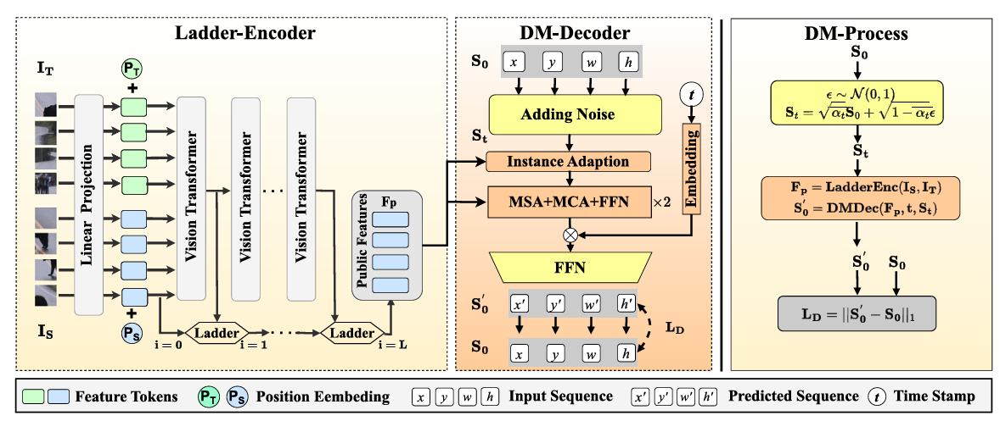 | [Paper](https://www.sciencedirect.com/science/article/abs/pii/S0031320325003541#:~:text=In%20this%20paper%2C%20we%20propose%20a%20novel%20approach,from%20limited%20discrete%20variables%20to%20unlimited%20continuous%20probabilities.) |

##### Generative Models
50 51 34 52 53 54 55 56 57 58 59 60 49 61 62 63
| Title & Authors | Introduction | Links |
| ------------- | ------------- | ------------- |
| [Auto-Encoding Variational Bayes](https://arxiv.org/abs/1312.6114)   Diederik P Kingma, Max Welling | 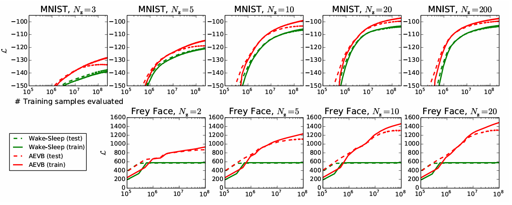 | [Paper](https://arxiv.org/abs/1312.6114) |
| [SINT++: Robust Visual Tracking via Adversarial Positive Instance Generation](https://ieeexplore.ieee.org/document/8578609)   Xiao Wang; Chenglong Li; Bin Luo; Jin Tang | 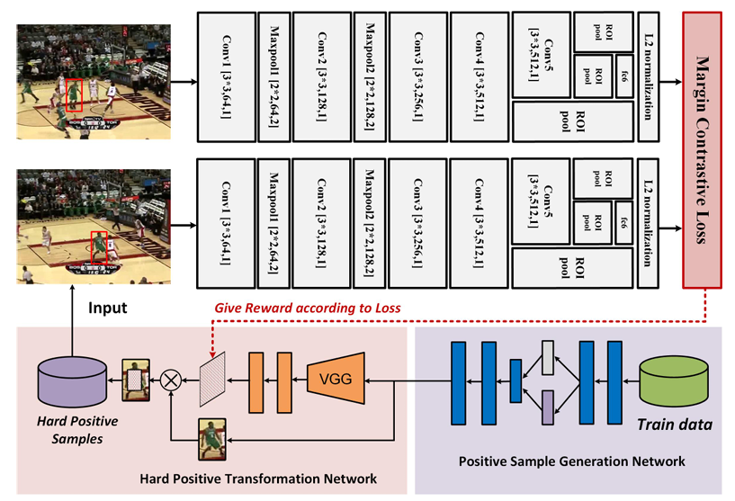 | [Paper](https://ieeexplore.ieee.org/document/8578609) |
| [Robust visual tracking based on variational auto-encoding Markov chain Monte Carlo](https://www.sciencedirect.com/science/article/abs/pii/S0020025519308618)   Junseok Kwon |  | [Paper](https://www.sciencedirect.com/science/article/abs/pii/S0020025519308618) |
| [Generative Adversarial Networks](https://arxiv.org/abs/1406.2661)   Ian J. Goodfellow, Jean Pouget-Abadie, Mehdi Mirza, Bing Xu, David Warde-Farley, Sherjil Ozair, Aaron Courville, Yoshua Bengio | 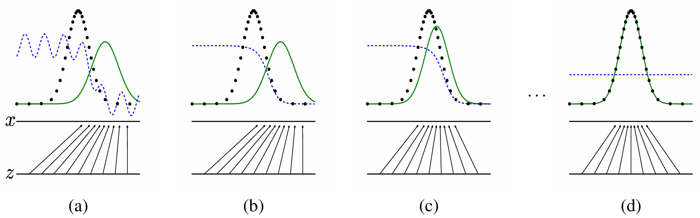 | [Paper](https://arxiv.org/abs/1406.2661) |
| [Generating Reliable Online Adaptive Templates for Visual Tracking](https://ieeexplore.ieee.org/document/8451440)   Jie Guo; Tingfa Xu; Shenwang Jiang; Ziyi Shen | 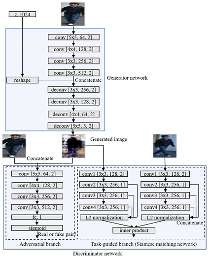 | [Paper](https://ieeexplore.ieee.org/document/8451440) |
| [VITAL: VIsual Tracking via Adversarial Learning](https://arxiv.org/abs/1804.04273)   Yibing Song, Chao Ma, Xiaohe Wu, Lijun Gong, Linchao Bao, Wangmeng Zuo, Chunhua Shen, Rynson Lau, Ming-Hsuan Yang | 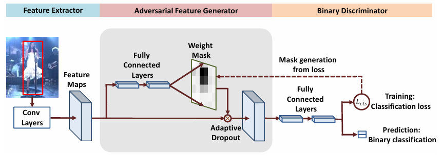 | [Paper](https://arxiv.org/abs/1804.04273) |
| [Adversarial Feature Sampling Learning for Efficient Visual Tracking](https://arxiv.org/abs/1809.04741)   Yingjie Yin, Lei Zhang, De Xu, Xingang Wang | 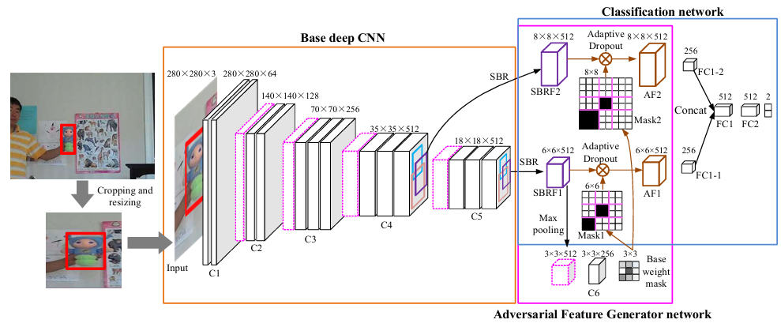 | [Paper](https://arxiv.org/abs/1809.04741) |
| [GARAT: Generative Adversarial Learning for Robust and Accurate Tracking](https://webvpn.whut.edu.cn/https/77726476706e69737468656265737421e7e056d234336155700b8ca891472636a6d29e640e/science/article/pii/S0893608022000107)   Bowen Yao, Jing Li, Shan Xue,Jia Wu, Huanmei Guan, Jun Chang, Zhiquan Ding | 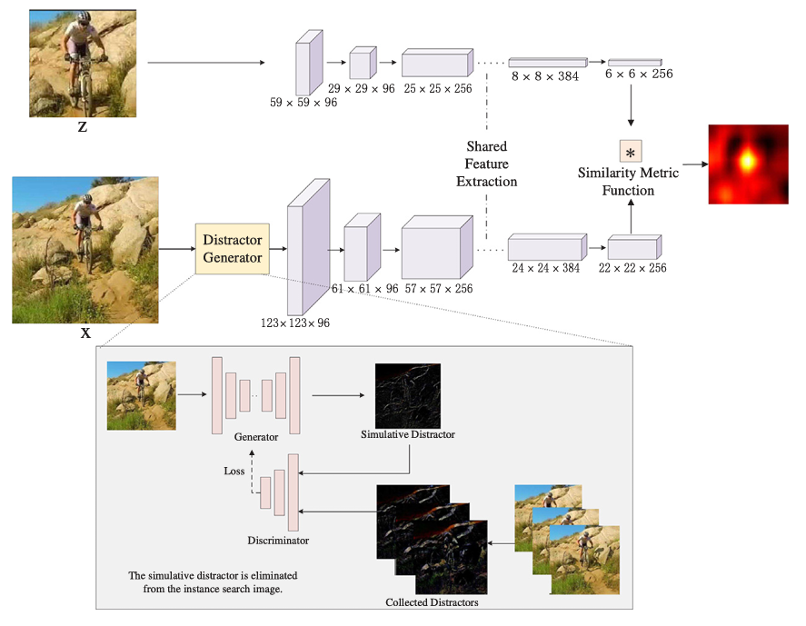 | [Paper](https://webvpn.whut.edu.cn/https/77726476706e69737468656265737421e7e056d234336155700b8ca891472636a6d29e640e/science/article/pii/S0893608022000107) |
| [Semi-supervised learning for optical flow with Generative Adversarial Networks](https://dl.acm.org/doi/10.5555/3294771.3294805)   Wei-Sheng Lai, Jia-Bin Huang, Ming-Hsuan Yang | 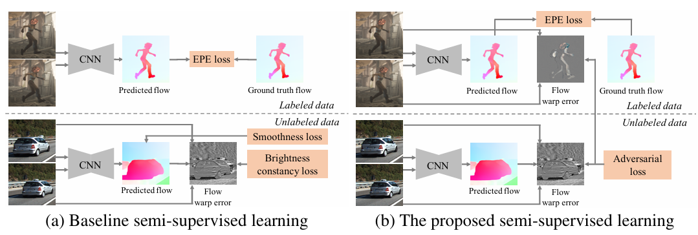 | [Paper](https://dl.acm.org/doi/10.5555/3294771.3294805) |
| [Denoising Diffusion Probabilistic Models](https://arxiv.org/abs/2006.11239)   Jonathan Ho, Ajay Jain, Pieter Abbeel | 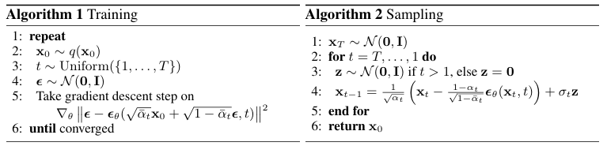 | [GitHub](https://github.com/hojonathanho/diffusion)   [Paper](https://arxiv.org/abs/2006.11239) |
| [Siamese Network for Object Tracking with Diffusion Model](https://dl.acm.org/doi/abs/10.1145/3604078.3604132)   Jiacheng Zhang, Yifeng Zhang | 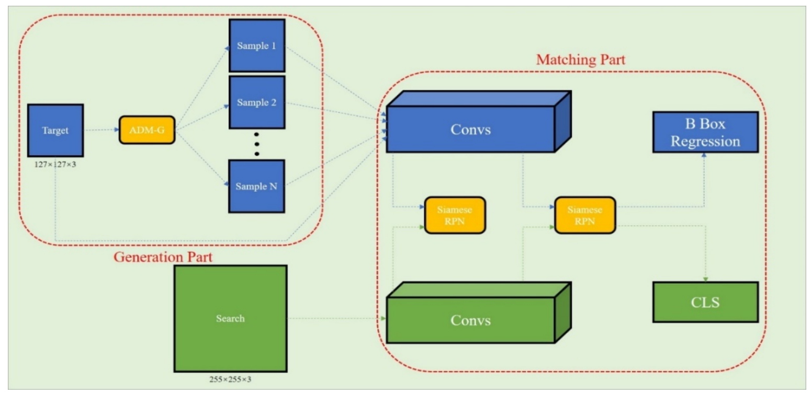 | [Paper](https://dl.acm.org/doi/abs/10.1145/3604078.3604132) |
| [DiffMOT: A Real-time Diffusion-based Multiple Object Tracker with Non-linear Prediction](https://arxiv.org/abs/2403.02075)   Weiyi Lv, Yuhang Huang, Ning Zhang, Ruei-Sung Lin, Mei Han, Dan Zeng | 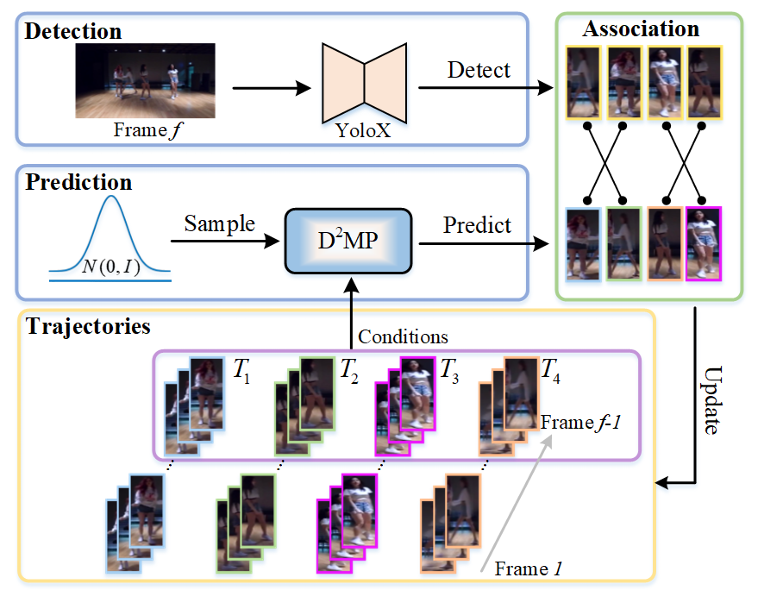 | [Paper](https://arxiv.org/abs/2403.02075) |
| [DSTrack: Diffusion-based sequence learning for visual object tracking](https://www.sciencedirect.com/science/article/abs/pii/S0031320325003541#:~:text=In%20this%20paper%2C%20we%20propose%20a%20novel%20approach,from%20limited%20discrete%20variables%20to%20unlimited%20continuous%20probabilities.)   Zhixing Wang, Kai Wang, Chuanming Tang, Xiang Li, Jianlin Zhang, Lianli Gao |  | [Paper](https://www.sciencedirect.com/science/article/abs/pii/S0031320325003541#:~:text=In%20this%20paper%2C%20we%20propose%20a%20novel%20approach,from%20limited%20discrete%20variables%20to%20unlimited%20continuous%20probabilities.) |
| [DiffusionTrack: Diffusion Model For Multi-Object Tracking](https://arxiv.org/abs/2308.09905)   Run Luo, Zikai Song, Lintao Ma, Jinlin Wei, Wei Yang, Min Yang | 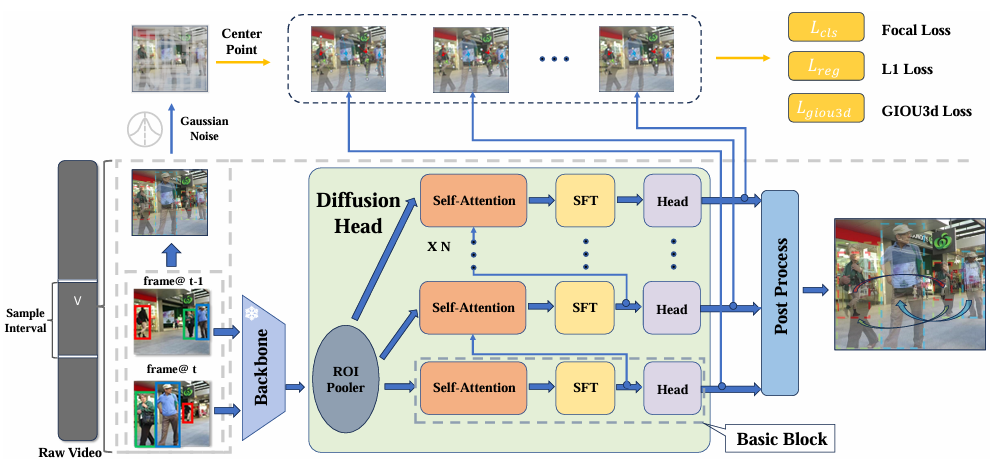 | [GitHub](https://github.com/RainBowLuoCS/DiffusionTrack)   [Paper](https://arxiv.org/abs/2308.09905) |
| [DiffMOD: Progressive Diffusion Point Denoising for Moving Object Detection in Remote Sensing](https://arxiv.org/abs/2504.10278)   Jinyue Zhang, Xiangrong Zhang, Zhongjian Huang, Tianyang Zhang, Yifei Jiang, Licheng Jiao | 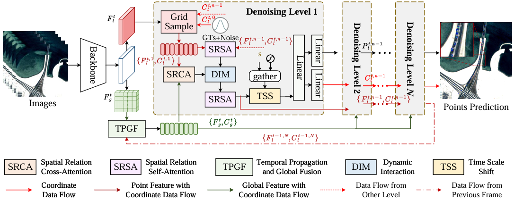 | [Paper](https://arxiv.org/abs/2504.10278) |
| [The Surprising Effectiveness of Diffusion Models for Optical Flow and Monocular Depth Estimation](https://arxiv.org/abs/2306.01923)   Saurabh Saxena, Charles Herrmann, Junhwa Hur, Abhishek Kar, Mohammad Norouzi, Deqing Sun, David J. Fleet | 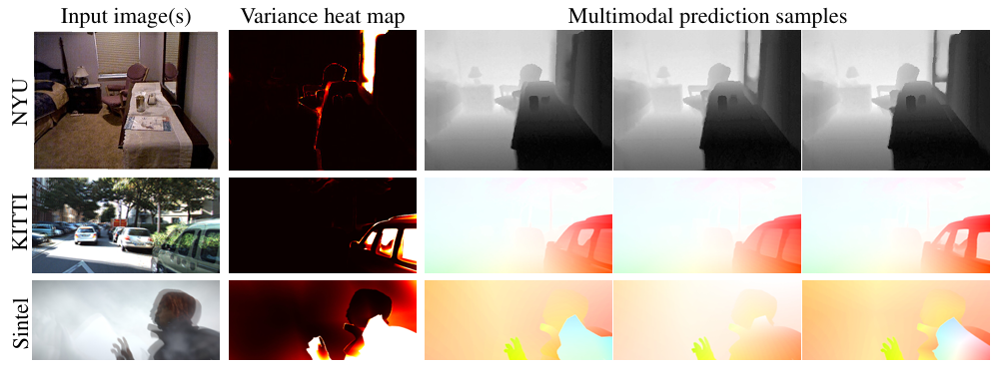 | [Paper](https://arxiv.org/abs/2306.01923) |

#### Estimation by Correlation

##### Explicit Computation
64 65 66 67 68 69 70 71 72 73 74 75 76 77 78 
| Title & Authors | Introduction | Links |
| ------------- | ------------- | ------------- |
| [Visual object tracking using adaptive correlation filters](https://webvpn.whut.edu.cn/https/77726476706e69737468656265737421f9f244993f20645f6c0dc7a59d50267b1ab4a9/document/5539960)   David S. Bolme; J. Ross Beveridge; Bruce A. Draper; Yui Man Lui | 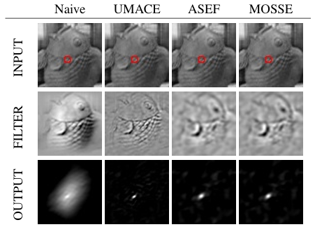 | [Paper](https://webvpn.whut.edu.cn/https/77726476706e69737468656265737421f9f244993f20645f6c0dc7a59d50267b1ab4a9/document/5539960) |
| [High-Speed Tracking with Kernelized Correlation Filters](https://arxiv.org/abs/1404.7584)   João F. Henriques, Rui Caseiro, Pedro Martins, Jorge Batista | 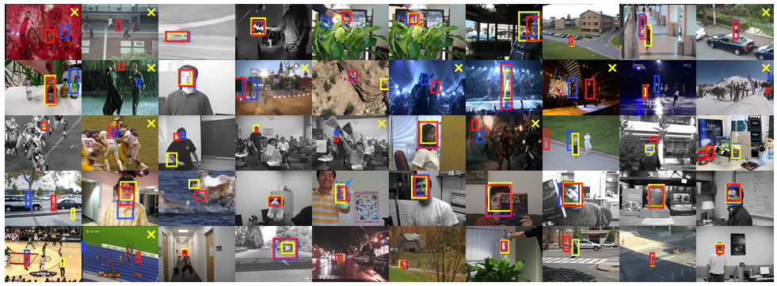 | [Paper](https://arxiv.org/abs/1404.7584) |
| [Exploiting the Circulant Structure of Tracking-by-Detection with Kernels](https://link.springer.com/chapter/10.1007/978-3-642-33765-9_50)   João F. Henriques, Rui Caseiro, Pedro Martins & Jorge Batista | 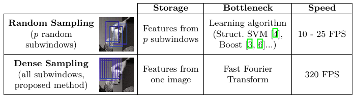 | [Paper](https://link.springer.com/chapter/10.1007/978-3-642-33765-9_50) |
| [Adaptive Color Attributes for Real-Time Visual Tracking](https://webvpn.whut.edu.cn/https/77726476706e69737468656265737421f9f244993f20645f6c0dc7a59d50267b1ab4a9/document/6909539)   Martin Danelljan; Fahad Shahbaz Khan; Michael Felsberg; Joost Van De Weijer | 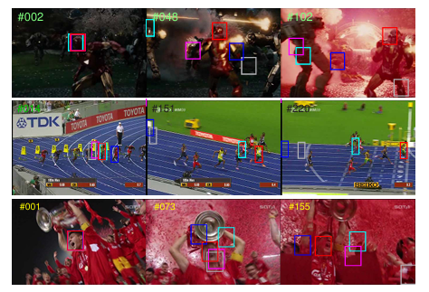 | [Paper](https://webvpn.whut.edu.cn/https/77726476706e69737468656265737421f9f244993f20645f6c0dc7a59d50267b1ab4a9/document/6909539) |
| [Staple: Complementary Learners for Real-Time Tracking](https://arxiv.org/abs/1512.01355)   Luca Bertinetto, Jack Valmadre, Stuart Golodetz, Ondrej Miksik, Philip Torr | 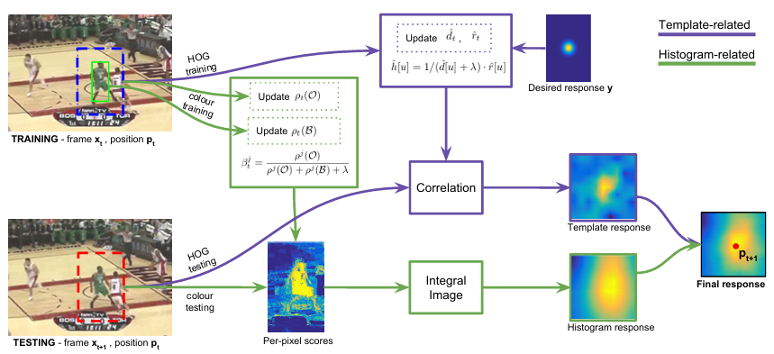 | [Paper](https://arxiv.org/abs/1512.01355) |
| [Learning Spatially Regularized Correlation Filters for Visual Tracking](https://arxiv.org/abs/1608.05571)   Martin Danelljan, Gustav Häger, Fahad Shahbaz Khan, Michael Felsberg | 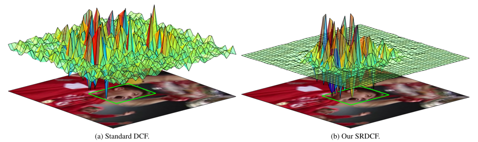 | [Paper](https://arxiv.org/abs/1608.05571) |
| [Discriminative Correlation Filter with Channel and Spatial Reliability](https://arxiv.org/abs/1611.08461)   Alan Lukežič, Tomáš Vojíř, Luka Čehovin, Jiří Matas, Matej Kristan |  | [Paper](https://arxiv.org/abs/1611.08461) |
| [Learning Background-Aware Correlation Filters for Visual Tracking](https://arxiv.org/abs/1703.04590)   Hamed Kiani Galoogahi, Ashton Fagg, Simon Lucey | 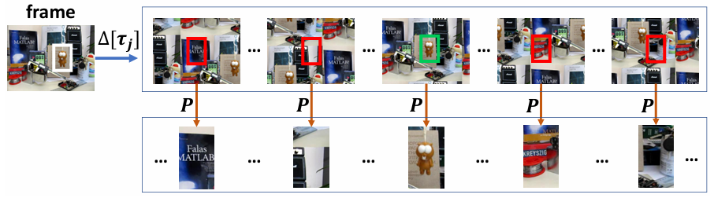 | [Paper](https://arxiv.org/abs/1703.04590) |
| [Correlation filters with limited boundaries](https://webvpn.whut.edu.cn/https/77726476706e69737468656265737421f9f244993f20645f6c0dc7a59d50267b1ab4a9/document/7299094)   Hamed Kiani Galoogahi; Terence Sim; Simon Lucey | 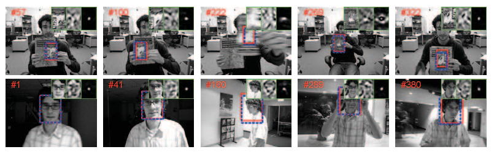 | [Paper](https://webvpn.whut.edu.cn/https/77726476706e69737468656265737421f9f244993f20645f6c0dc7a59d50267b1ab4a9/document/7299094) |
| [Visual Tracking via Adaptive Spatially-Regularized Correlation Filters](https://webvpn.whut.edu.cn/https/77726476706e69737468656265737421f9f244993f20645f6c0dc7a59d50267b1ab4a9/document/8953651)   Kenan Dai; Dong Wang; Huchuan Lu; Chong Sun; Jianhua Li | 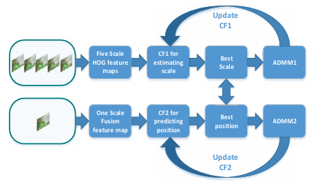 | [Paper](https://webvpn.whut.edu.cn/https/77726476706e69737468656265737421f9f244993f20645f6c0dc7a59d50267b1ab4a9/document/8953651) |
| [Beyond Correlation Filters: Learning Continuous Convolution Operators for Visual Tracking](https://arxiv.org/abs/1608.03773)   Martin Danelljan, Andreas Robinson, Fahad Shahbaz Khan, Michael Felsberg | 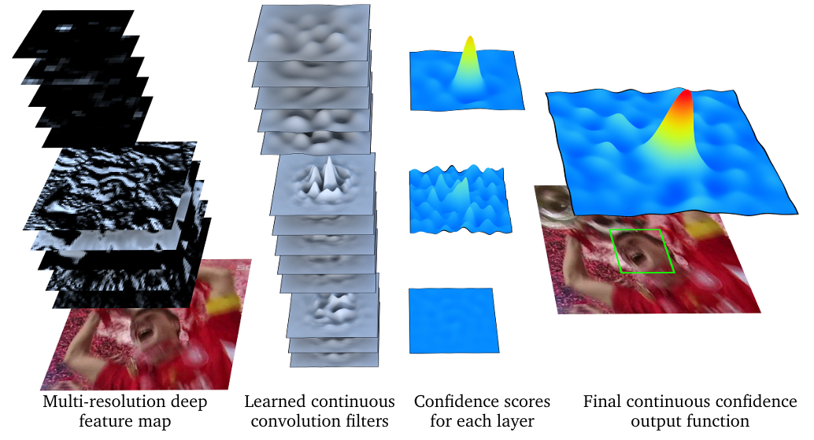 | [Paper](https://arxiv.org/abs/1608.03773) |
| [ECO: Efficient Convolution Operators for Tracking](https://arxiv.org/abs/1611.09224)   Martin Danelljan, Goutam Bhat, Fahad Shahbaz Khan, Michael Felsberg | 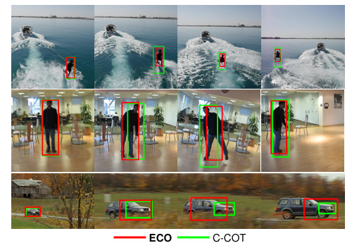 | [Paper](https://arxiv.org/abs/1611.09224) |
| [Unveiling the Power of Deep Tracking](https://arxiv.org/abs/1804.06833)   Goutam Bhat, Joakim Johnander, Martin Danelljan, Fahad Shahbaz Khan, Michael Felsberg | 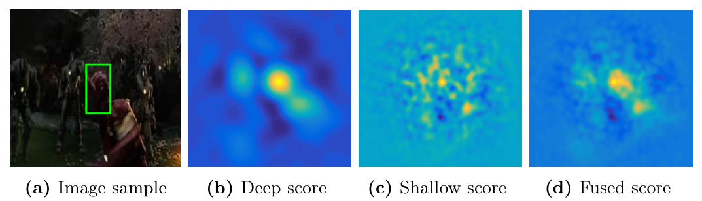 | [Paper](https://arxiv.org/abs/1804.06833) |
| [Determining optical flow](https://www.sciencedirect.com/science/article/abs/pii/0004370281900242)   Berthold K.P. Horn, Brian G. Schunck | 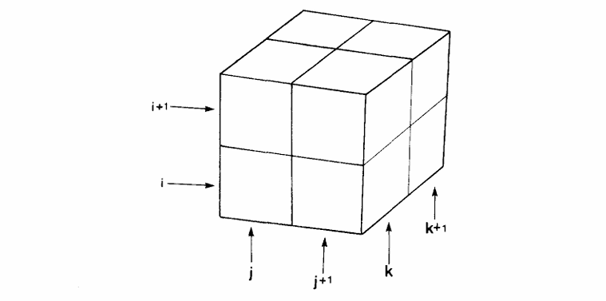 | [Paper](https://www.sciencedirect.com/science/article/abs/pii/0004370281900242) |
| [An iterative image registration technique with an application to stereo vision](https://dl.acm.org/doi/10.5555/1623264.1623280)   Bruce D. Lucas, Takeo Kanade | 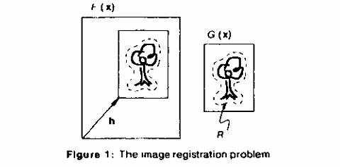 | [Paper](https://dl.acm.org/doi/10.5555/1623264.1623280) |

##### Two-Stream Architecture
79 80 81 82 83 84 85 86 87 88 89 90 91 92 93 94 95 96 
| Title & Authors | Introduction | Links |
| ------------- | ------------- | ------------- |
| [Fully-Convolutional Siamese Networks for Object Tracking](https://arxiv.org/abs/1606.09549)   Luca Bertinetto, Jack Valmadre, João F. Henriques, Andrea Vedaldi, Philip H. S. Torr | 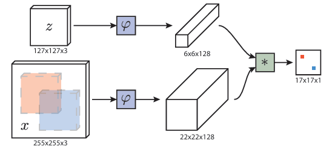 | [Paper](https://arxiv.org/abs/1606.09549) |
| [Siamese Instance Search for Tracking](https://arxiv.org/abs/1605.05863)   Ran Tao, Efstratios Gavves, Arnold W.M. Smeulders | 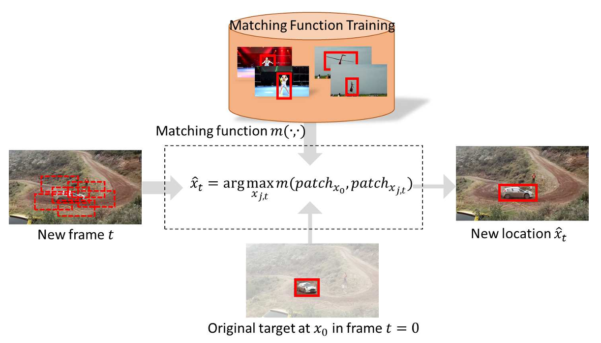 | [Paper](https://arxiv.org/abs/1605.05863) |
| [High Performance Visual Tracking with Siamese Region Proposal Network](https://ieeexplore.ieee.org/document/8579033)   Bo Li; Junjie Yan; Wei Wu; Zheng Zhu; Xiaolin Hu | 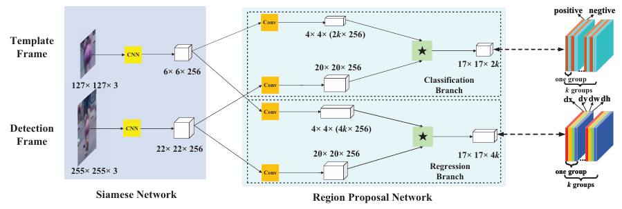 | [Paper](https://ieeexplore.ieee.org/document/8579033) |
| [Distractor-aware Siamese Networks for Visual Object Tracking](https://arxiv.org/abs/1808.06048)   Zheng Zhu, Qiang Wang, Bo Li, Wei Wu, Junjie Yan, Weiming Hu | 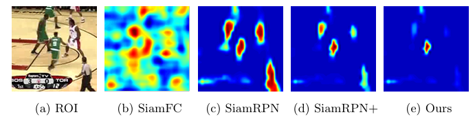 | [GitHub](https://github.com/foolwood/DaSiamRPN)   [Paper](https://arxiv.org/abs/1808.06048) |
| [SiamRPN++: Evolution of Siamese Visual Tracking with Very Deep Networks](https://arxiv.org/abs/1812.11703)   Bo Li, Wei Wu, Qiang Wang, Fangyi Zhang, Junliang Xing, Junjie Yan | 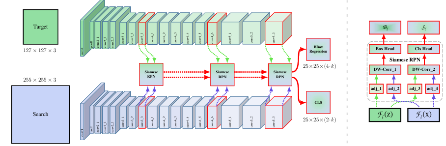 | [GitHub](https://lb1100.github.io/SiamRPN++/)   [Paper](https://arxiv.org/abs/1812.11703) |
| [Deeper and Wider Siamese Networks for Real-Time Visual Tracking](https://arxiv.org/abs/1901.01660)   Zhipeng Zhang, Houwen Peng | 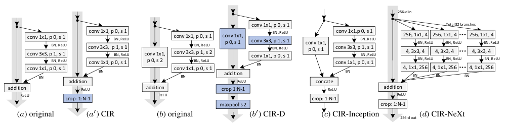 | [Paper](https://arxiv.org/abs/1901.01660) |
| [Ocean: Object-aware Anchor-free Tracking](https://arxiv.org/abs/2006.10721)   Zhipeng Zhang, Houwen Peng, Jianlong Fu, Bing Li, Weiming Hu | 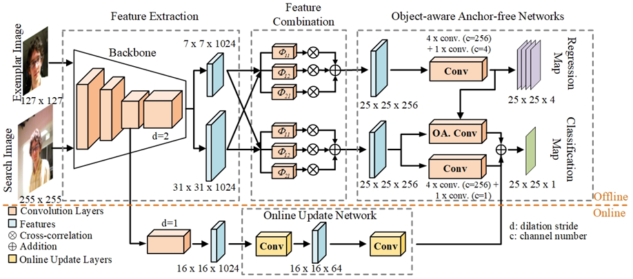 | [GitHub](https://github.com/researchmm/TracKit)   [Paper](https://arxiv.org/abs/2006.10721) |
| [SiamCAR: Siamese Fully Convolutional Classification and Regression for Visual Tracking](https://arxiv.org/abs/1911.07241)   Dongyan Guo, Jun Wang, Ying Cui, Zhenhua Wang, Shengyong Chen | 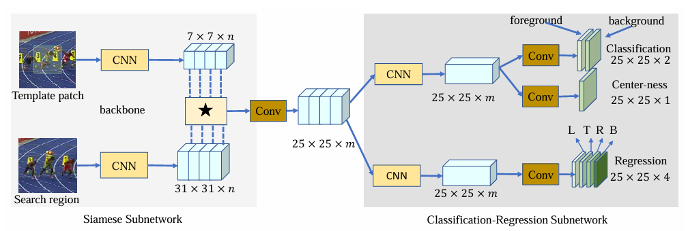 | [Paper](https://arxiv.org/abs/1911.07241) |
| [Siamese Box Adaptive Network for Visual Tracking](https://arxiv.org/abs/2003.06761)   Zedu Chen, Bineng Zhong, Guorong Li, Shengping Zhang, Rongrong Ji | 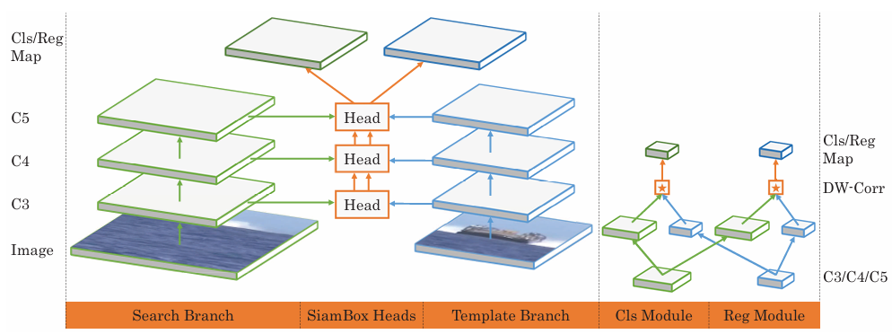 | [GitHub](https://github.com/hqucv/siamban)   [Paper](https://arxiv.org/abs/2003.06761) |
| [Fast Online Object Tracking and Segmentation: A Unifying Approach](https://arxiv.org/abs/1812.05050)   Qiang Wang, Li Zhang, Luca Bertinetto, Weiming Hu, Philip H.S. Torr | 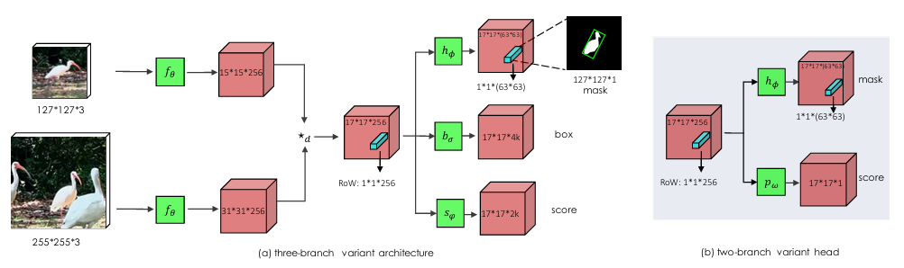 | [GitHub](https://www.robots.ox.ac.uk/~qwang/SiamMask/)   [Paper](https://arxiv.org/abs/1812.05050) |
| [Graph Attention Tracking](https://arxiv.org/abs/2011.11204)   Dongyan Guo, Yanyan Shao, Ying Cui, Zhenhua Wang, Liyan Zhang, Chunhua Shen | 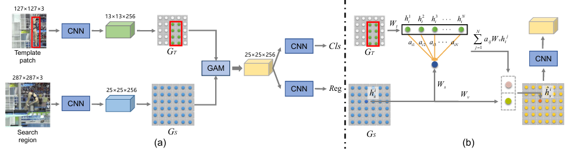 | [GitHub](https://github.com/ohhhyeahhh/SiamGAT)   [Paper](https://arxiv.org/abs/2011.11204) |
| [Siam R-CNN: Visual Tracking by Re-Detection](https://arxiv.org/abs/1911.12836)   Paul Voigtlaender, Jonathon Luiten, Philip H.S. Torr, Bastian Leibe | 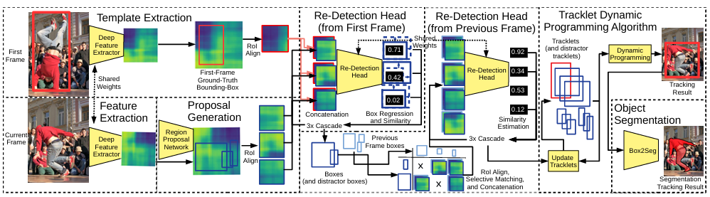 | [GitHub](http://www.vision.rwth-aachen.de/page/siamrcnn)   [Paper](https://arxiv.org/abs/1911.12836) |
| [BoT-SORT: Robust Associations Multi-Pedestrian Tracking](https://arxiv.org/abs/2206.14651)   Nir Aharon, Roy Orfaig, Ben-Zion Bobrovsky | 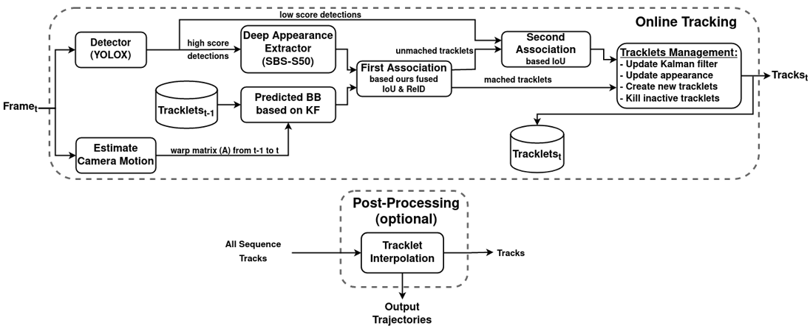 | [GitHub](https://github.com/NirAharon/BOT-SORT)   [Paper](https://arxiv.org/abs/2206.14651) |
| [When to Extract ReID Features: A Selective Approach for Improved Multiple Object Tracking](https://arxiv.org/abs/2409.06617)   Emirhan Bayar, Cemal Aker | 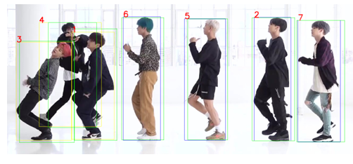 | [GitHub](https://github.com/emirhanbayar/Fast-StrongSORT)   [GitHub](https://github.com/emirhanbayar/Fast-Deep-OC-SORT)   [Paper](https://arxiv.org/abs/2409.06617) |
| [History-Aware Transformation of ReID Features for Multiple Object Tracking](https://arxiv.org/abs/2503.12562)   Ruopeng Gao, Yuyao Wang, Chunxu Liu, Limin Wang | 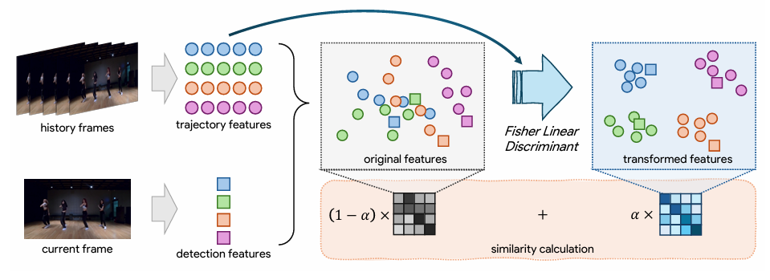 | [GitHub](https://github.com/HELLORPG/HATReID-MOT)   [Paper](https://arxiv.org/abs/2503.12562) |
| [FlowNet: Learning Optical Flow with Convolutional Networks](https://arxiv.org/abs/1504.06852)   Philipp Fischer, Alexey Dosovitskiy, Eddy Ilg, Philip Häusser, Caner Hazırbaş, Vladimir Golkov, Patrick van der Smagt, Daniel Cremers, Thomas Brox | 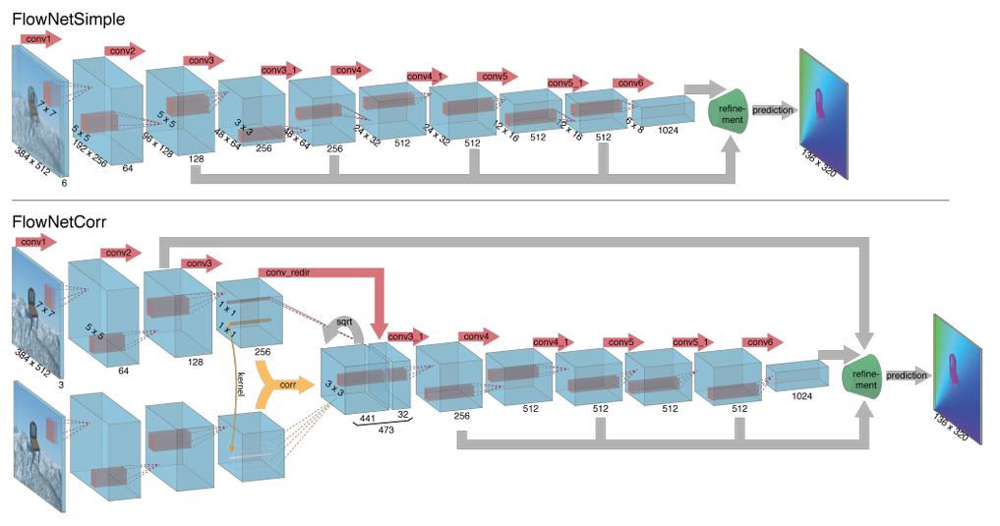 | [Paper](https://arxiv.org/abs/1504.06852) |
| [PWC-Net: CNNs for Optical Flow Using Pyramid, Warping, and Cost Volume](https://arxiv.org/abs/1709.02371)   Deqing Sun, Xiaodong Yang, Ming-Yu Liu, Jan Kautz | 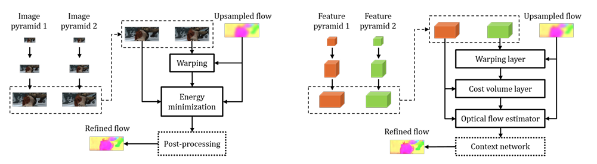 | [GitHub](https://github.com/NVlabs/PWC-Net)   [Paper](https://arxiv.org/abs/1709.02371) |
| [LiteFlowNet: A Lightweight Convolutional Neural Network for Optical Flow Estimation](https://arxiv.org/abs/1805.07036)   Tak-Wai Hui, Xiaoou Tang, Chen Change Loy | 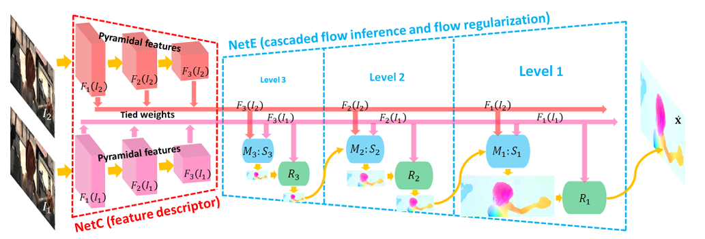 | [GitHub](https://github.com/twhui/LiteFlowNet)   [Paper](https://arxiv.org/abs/1805.07036) |

##### Attention Mechanism
97 98 99 100 101 102 103 104 105 106 107 108 109 110 111 112 113 114 115 44 93 49 45 116 117 
| Title & Authors | Introduction | Links |
| ------------- | ------------- | ------------- |
| [Transformer Tracking](https://arxiv.org/abs/2103.15436)   Xin Chen, Bin Yan, Jiawen Zhu, Dong Wang, Xiaoyun Yang, Huchuan Lu | 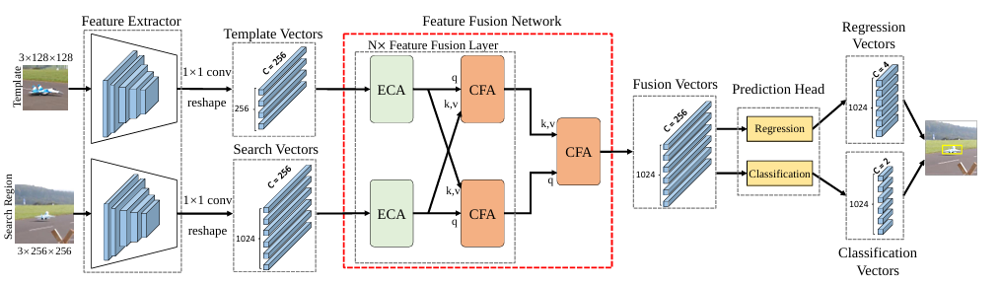 | [GitHub](https://github.com/chenxin-dlut/TransT)   [Paper](https://arxiv.org/abs/2103.15436) |
| [Learning Spatio-Temporal Transformer for Visual Tracking](https://arxiv.org/abs/2103.17154)   Bin Yan, Houwen Peng, Jianlong Fu, Dong Wang, Huchuan Lu | 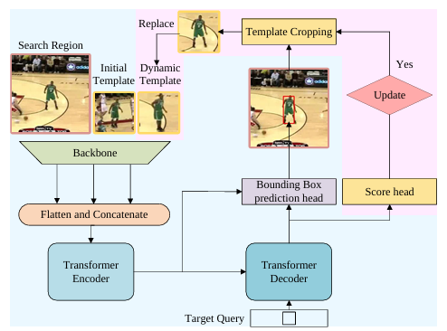 | [GitHub](https://github.com/researchmm/Stark)   [Paper](https://arxiv.org/abs/2103.17154) |
| [Transformer Meets Tracker: Exploiting Temporal Context for Robust Visual Tracking](https://arxiv.org/abs/2103.11681)   Ning Wang, Wengang Zhou, Jie Wang, Houqaing Li | 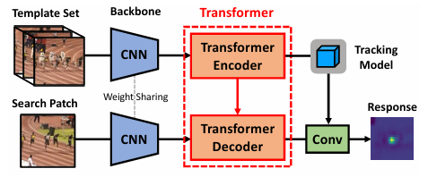 | [GitHub](https://github.com/594422814/TransformerTrack)   [Paper](https://arxiv.org/abs/2103.11681) |
| [AiATrack: Attention in Attention for Transformer Visual Tracking](https://arxiv.org/abs/2207.09603)   Shenyuan Gao, Chunluan Zhou, Chao Ma, Xinggang Wang, Junsong Yuan | 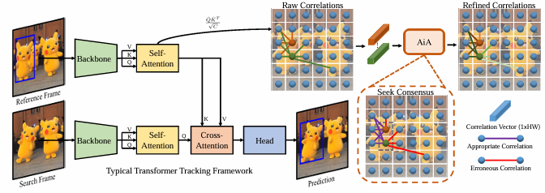 | [GitHub](https://github.com/Little-Podi/AiATrack)   [Paper](https://arxiv.org/abs/2207.09603) |
| [Transformer Tracking with Cyclic Shifting Window Attention](https://arxiv.org/abs/2205.03806)   Zikai Song, Junqing Yu, Yi-Ping Phoebe Chen, Wei Yang | 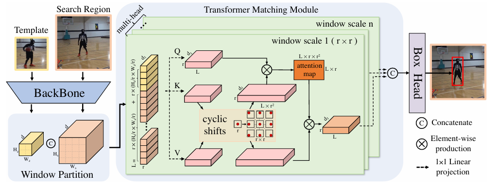 | [GitHub](https://github.com/SkyeSong38/CSWinTT)   [Paper](https://arxiv.org/abs/2205.03806) |
| [MixFormer: End-to-End Tracking with Iterative Mixed Attention](https://arxiv.org/abs/2203.11082)   Yutao Cui, Cheng Jiang, Limin Wang, Gangshan Wu | 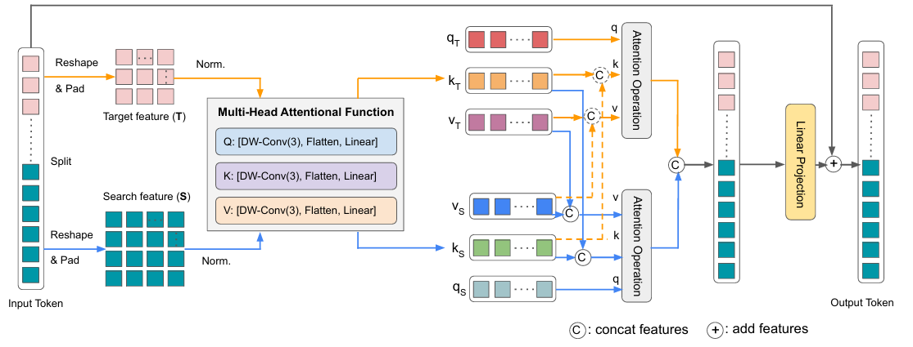 | [GitHub](https://github.com/MCG-NJU/MixFormer)   [Paper](https://arxiv.org/abs/2203.11082) |
| [Joint Feature Learning and Relation Modeling for Tracking: A One-Stream Framework](https://arxiv.org/abs/2203.11991)   Botao Ye, Hong Chang, Bingpeng Ma, Shiguang Shan, Xilin Chen | 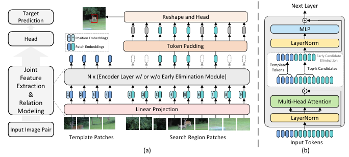 | [GitHub](https://github.com/botaoye/OSTrack)   [Paper](https://arxiv.org/abs/2203.11991) |
| [Backbone is All Your Need: A Simplified Architecture for Visual Object Tracking](https://arxiv.org/abs/2203.05328)   Boyu Chen, Peixia Li, Lei Bai, Lei Qiao, Qiuhong Shen, Bo Li, Weihao Gan, Wei Wu, Wanli Ouyang | 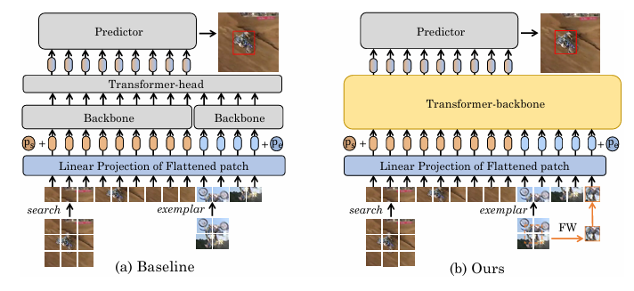 | [GitHub](https://github.com/LPXTT/SimTrack)   [Paper](https://arxiv.org/abs/2203.05328) |
| [ProContEXT: Exploring Progressive Context Transformer for Tracking](https://arxiv.org/abs/2210.15511)   Jin-Peng Lan, Zhi-Qi Cheng, Jun-Yan He, Chenyang Li, Bin Luo, Xu Bao, Wangmeng Xiang, Yifeng Geng, Xuansong Xie | 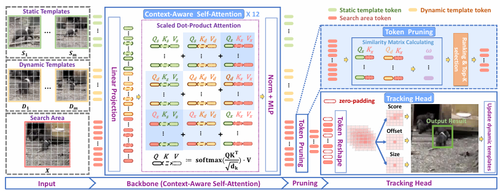 | [GitHub](https://github.com/jp-lan/ProContEXT)   [Paper](https://arxiv.org/abs/2210.15511) |
| [VideoTrack: Learning to Track Objects via Video Transformer](https://ieeexplore.ieee.org/document/10204143)   Fei Xie; Lei Chu; Jiahao Li; Yan Lu; Chao Ma | 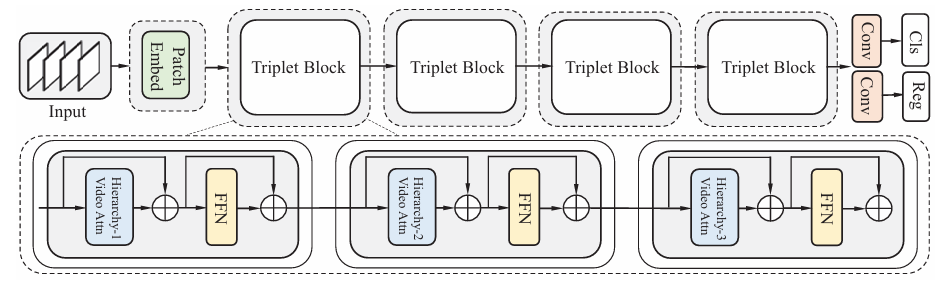 | [Paper](https://ieeexplore.ieee.org/document/10204143) |
| [Learning Tracking Representations via Dual-Branch Fully Transformer Networks](https://arxiv.org/abs/2112.02571)   Fei Xie, Chunyu Wang, Guangting Wang, Wankou Yang, Wenjun Zeng | 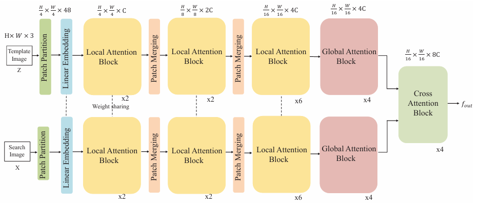 | [GitHub](https://github.com/phiphiphi31/DualTFR)   [Paper](https://arxiv.org/abs/2112.02571) |
| [SwinTrack: A Simple and Strong Baseline for Transformer Tracking](https://arxiv.org/abs/2112.00995)   Liting Lin, Heng Fan, Zhipeng Zhang, Yong Xu, Haibin Ling | 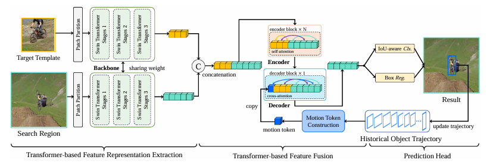 | [GitHub](https://github.com/LitingLin/SwinTrack)   [Paper](https://arxiv.org/abs/2112.00995) |
| [Learning Attentions: Residual Attentional Siamese Network for High Performance Online Visual Tracking](https://ieeexplore.ieee.org/document/8578608)   Qiang Wang; Zhu Teng; Junliang Xing; Jin Gao; Weiming Hu; Stephen Maybank | 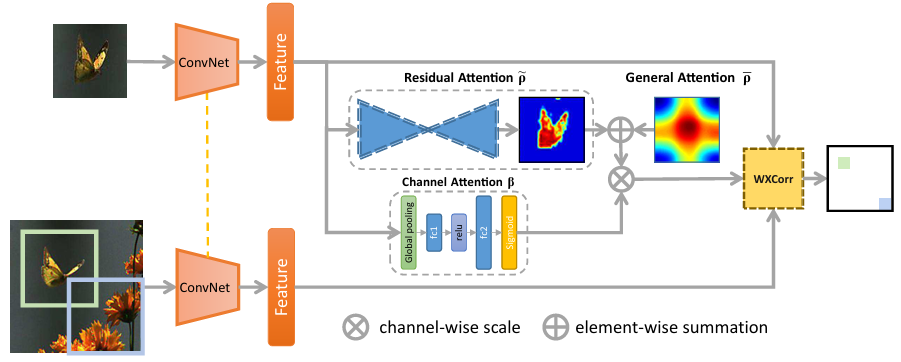 | [GitHub](https://github.com/foolwood/RASNet)   [Paper](https://ieeexplore.ieee.org/document/8578608) |
| [Deformable Siamese Attention Networks for Visual Object Tracking](https://arxiv.org/abs/2004.06711)   Yuechen Yu, Yilei Xiong, Weilin Huang, Matthew R. Scott | 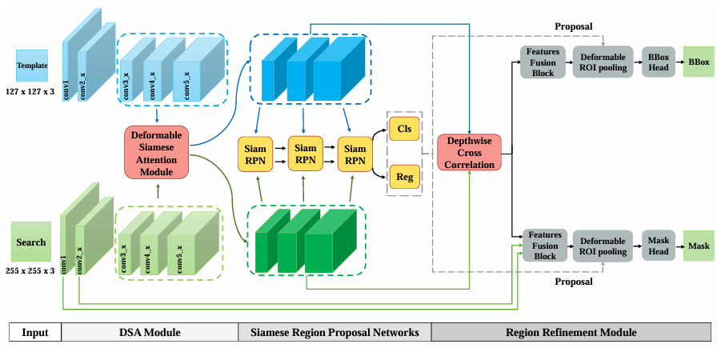 | [GitHub](https://github.com/msight-tech/research-siamattn)   [Paper](https://arxiv.org/abs/2004.06711) |
| [HiFT: Hierarchical Feature Transformer for Aerial Tracking](https://arxiv.org/abs/2108.00202)   Ziang Cao, Changhong Fu, Junjie Ye, Bowen Li, Yiming Li | 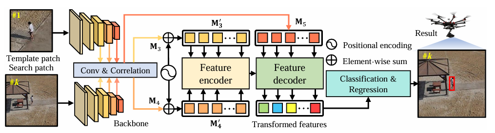 | [GitHub](https://github.com/vision4robotics/HiFT)   [Paper](https://arxiv.org/abs/2108.00202) |
| [Transforming Model Prediction for Tracking](https://arxiv.org/abs/2203.11192)   Christoph Mayer, Martin Danelljan, Goutam Bhat, Matthieu Paul, Danda Pani Paudel, Fisher Yu, Luc Van Gool | 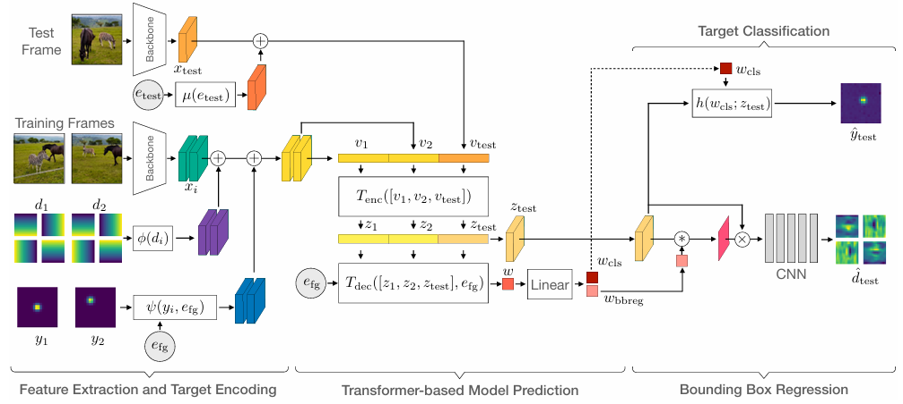 | [GitHub](https://github.com/visionml/pytracking)   [Paper](https://arxiv.org/abs/2203.11192) |
| [High-Performance Discriminative Tracking with Transformers](https://ieeexplore.ieee.org/document/9710969)   Bin Yu; Ming Tang; Linyu Zheng; Guibo Zhu; Jinqiao Wang; Hao Feng | 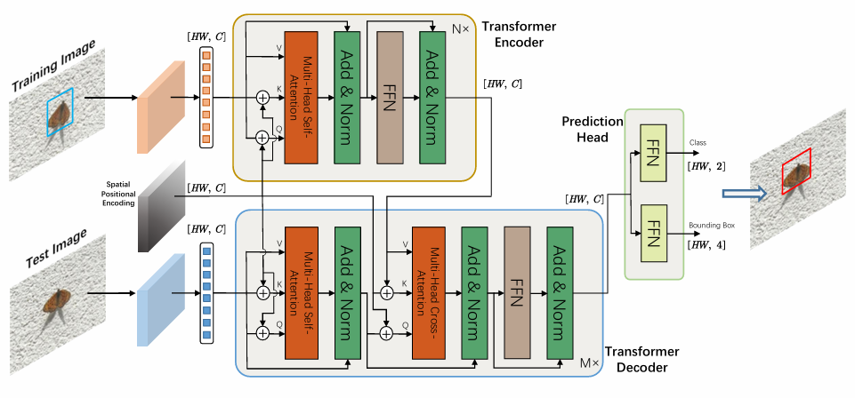 | [Paper](https://ieeexplore.ieee.org/document/9710969) |
| [SparseTT: Visual Tracking with Sparse Transformers](https://arxiv.org/abs/2205.03776)   Zhihong Fu, Zehua Fu, Qingjie Liu, Wenrui Cai, Yunhong Wang | 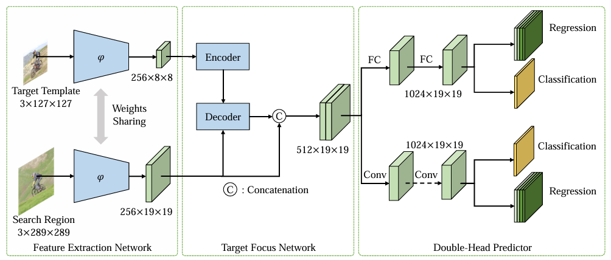 | [GitHub](https://github.com/fzh0917/SparseTT)   [Paper](https://arxiv.org/abs/2205.03776) |
| [Generalized Relation Modeling for Transformer Tracking](https://arxiv.org/abs/2303.16580)   Shenyuan Gao, Chunluan Zhou, Jun Zhang | 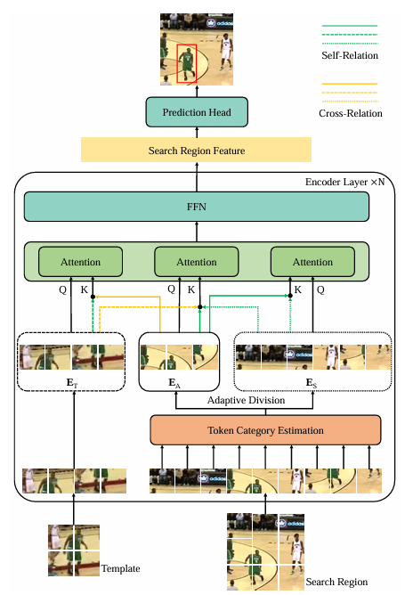 | [GitHub](https://github.com/Little-Podi/GRM)   [Paper](https://arxiv.org/abs/2303.16580) |
| [Is a Pure Transformer Effective for Separated and Online Multi-Object Tracking?](https://arxiv.org/abs/2405.14119)   Chongwei Liu, Haojie Li, Zhihui Wang, Rui Xu |  | [GitHub](https://github.com/chongweiliu/PuTR)   [Paper](https://arxiv.org/abs/2405.14119) |
| [History-Aware Transformation of ReID Features for Multiple Object Tracking](https://arxiv.org/abs/2503.12562)   Ruopeng Gao, Yuyao Wang, Chunxu Liu, Limin Wang |  | [GitHub](https://github.com/HELLORPG/HATReID-MOT)   [Paper](https://arxiv.org/abs/2503.12562) |
| [DSTrack: Diffusion-based sequence learning for visual object tracking](https://www.sciencedirect.com/science/article/abs/pii/S0031320325003541#:~:text=In%20this%20paper%2C%20we%20propose%20a%20novel%20approach,from%20limited%20discrete%20variables%20to%20unlimited%20continuous%20probabilities.)   Zhixing Wang, Kai Wang, Chuanming Tang, Xiang Li, Jianlin Zhang, Lianli Gao |  | [Paper](https://www.sciencedirect.com/science/article/abs/pii/S0031320325003541#:~:text=In%20this%20paper%2C%20we%20propose%20a%20novel%20approach,from%20limited%20discrete%20variables%20to%20unlimited%20continuous%20probabilities.) |
| [FlowFormer: A Transformer Architecture for Optical Flow](https://arxiv.org/abs/2203.16194)   Zhaoyang Huang, Xiaoyu Shi, Chao Zhang, Qiang Wang, Ka Chun Cheung, Hongwei Qin, Jifeng Dai, Hongsheng Li |  | [Paper](https://arxiv.org/abs/2203.16194) |
| [Global Matching with Overlapping Attention for Optical Flow Estimation](https://arxiv.org/abs/2203.11335)   Shiyu Zhao, Long Zhao, Zhixing Zhang, Enyu Zhou, Dimitris Metaxas | 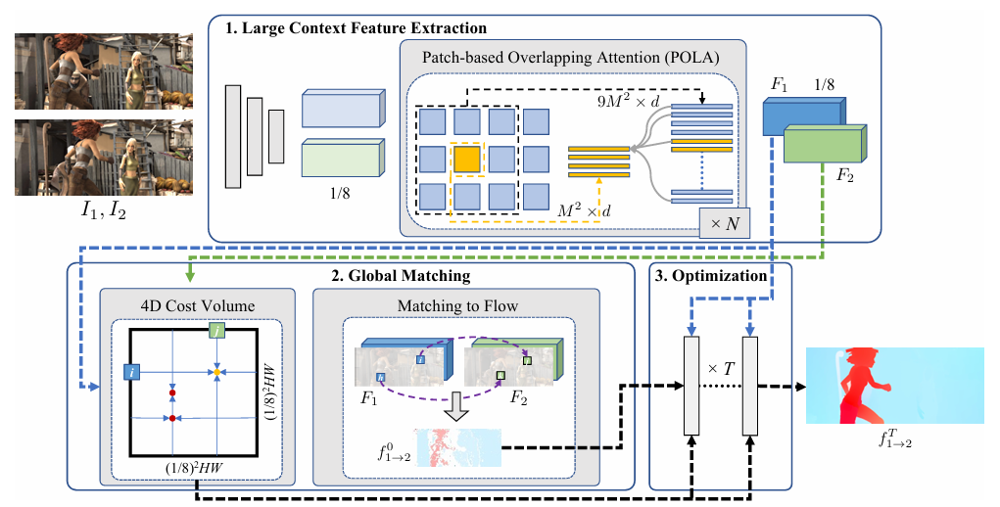 | [GitHub](https://github.com/xiaofeng94/GMFlowNet)   [Paper](https://arxiv.org/abs/2203.11335) |
| [VideoFlow: Exploiting Temporal Cues for Multi-frame Optical Flow Estimation](https://arxiv.org/abs/2303.08340)   Xiaoyu Shi, Zhaoyang Huang, Weikang Bian, Dasong Li, Manyuan Zhang, Ka Chun Cheung, Simon See, Hongwei Qin, Jifeng Dai, Hongsheng Li | 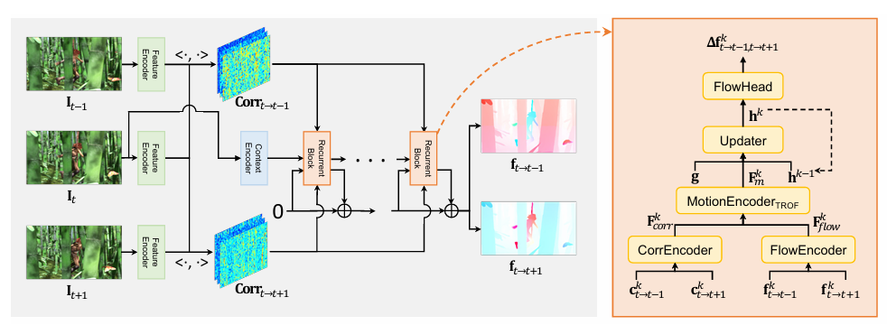 | [GitHub](https://github.com/XiaoyuShi97/VideoFlow)   [Paper](https://arxiv.org/abs/2303.08340) |

##### Implicit Learning
118 119 120 121 122 123 124 125 126 127 128
| Title & Authors | Introduction | Links |
| ------------- | ------------- | ------------- |
| [Learning Multi-Domain Convolutional Neural Networks for Visual Tracking](https://arxiv.org/abs/1510.07945)   Hyeonseob Nam, Bohyung Han | 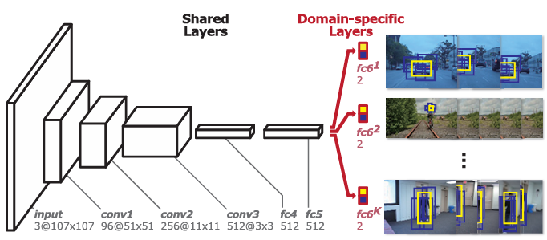 | [Paper](https://arxiv.org/abs/1510.07945) |
| [Real-Time MDNet](https://arxiv.org/abs/1808.08834)   Ilchae Jung, Jeany Son, Mooyeol Baek, Bohyung Han | 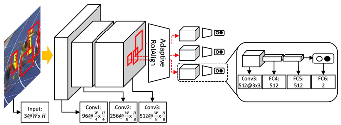 | [Paper](https://arxiv.org/abs/1808.08834) |
| [Modeling and Propagating CNNs in a Tree Structure for Visual Tracking](https://arxiv.org/abs/1608.07242)   Hyeonseob Nam, Mooyeol Baek, Bohyung Han | 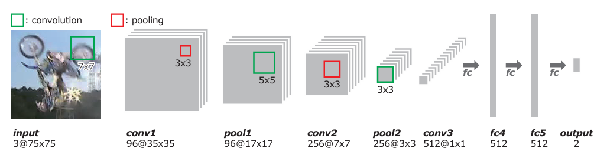 | [Paper](https://arxiv.org/abs/1608.07242) |
| [ATOM: Accurate Tracking by Overlap Maximization](https://arxiv.org/abs/1811.07628)   Martin Danelljan, Goutam Bhat, Fahad Shahbaz Khan, Michael Felsberg | 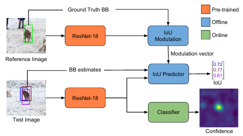 | [GitHub](https://github.com/visionml/pytracking)   [Paper](https://arxiv.org/abs/1811.07628) |
| [Learning Discriminative Model Prediction for Tracking](https://arxiv.org/abs/1904.07220)   Goutam Bhat, Martin Danelljan, Luc Van Gool, Radu Timofte | 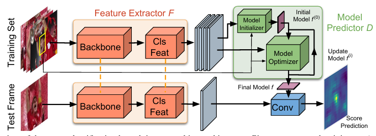 | [GitHub](https://github.com/visionml/pytracking)   [Paper](https://arxiv.org/abs/1904.07220) |
| [Probabilistic Regression for Visual Tracking](https://arxiv.org/abs/2003.12565)   Martin Danelljan, Luc Van Gool, Radu Timofte | 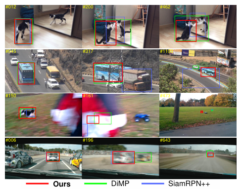 | [GitHub](https://github.com/visionml/pytracking)   [Paper](https://arxiv.org/abs/2003.12565) |
| [CREST: Convolutional Residual Learning for Visual Tracking](https://arxiv.org/abs/1708.00225)   Yibing Song, Chao Ma, Lijun Gong, Jiawei Zhang, Rynson Lau, Ming-Hsuan Yang | 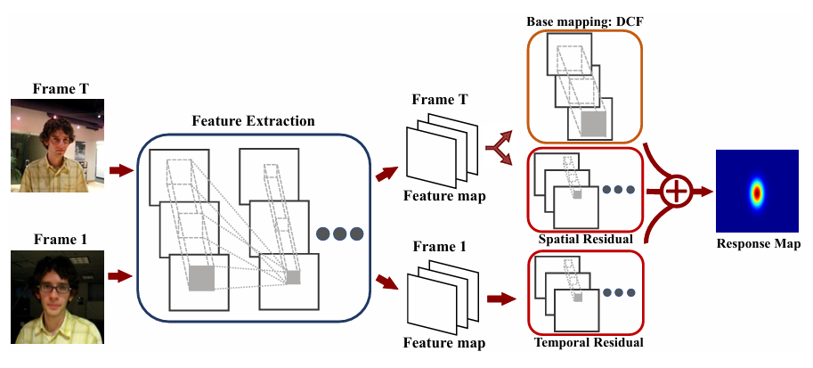 | [Paper](https://arxiv.org/abs/1708.00225) |
| [Graph Convolutional Tracking](https://ieeexplore.ieee.org/document/8953448)   Junyu Gao; Tianzhu Zhang; Changsheng Xu | 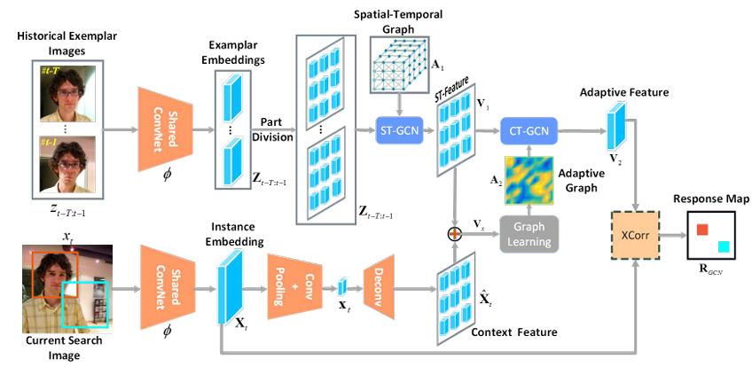 | [Paper](https://ieeexplore.ieee.org/document/8953448) |
| [Unifying Short and Long-Term Tracking with Graph Hierarchies](https://arxiv.org/abs/2212.03038)   Orcun Cetintas, Guillem Brasó, Laura Leal-Taixé | 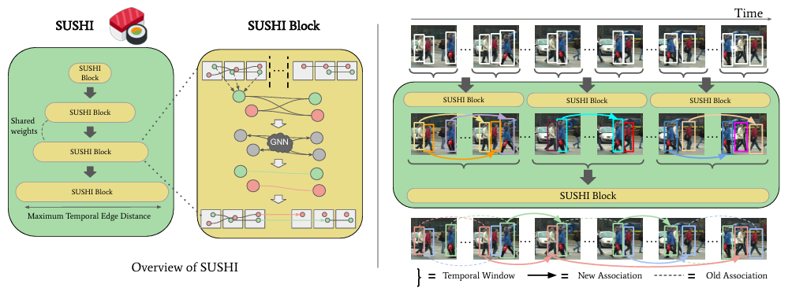 | [GitHub](https://github.com/dvl-tum/SUSHI)   [Paper](https://arxiv.org/abs/2212.03038) |
| [FlowNet 2.0: Evolution of Optical Flow Estimation with Deep Networks](https://arxiv.org/abs/1612.01925)   Eddy Ilg, Nikolaus Mayer, Tonmoy Saikia, Margret Keuper, Alexey Dosovitskiy, Thomas Brox |  | [Paper](https://arxiv.org/abs/1612.01925) |
| [Optical Flow Estimation using a Spatial Pyramid Network](https://arxiv.org/abs/1611.00850)   Anurag Ranjan, Michael J. Black | 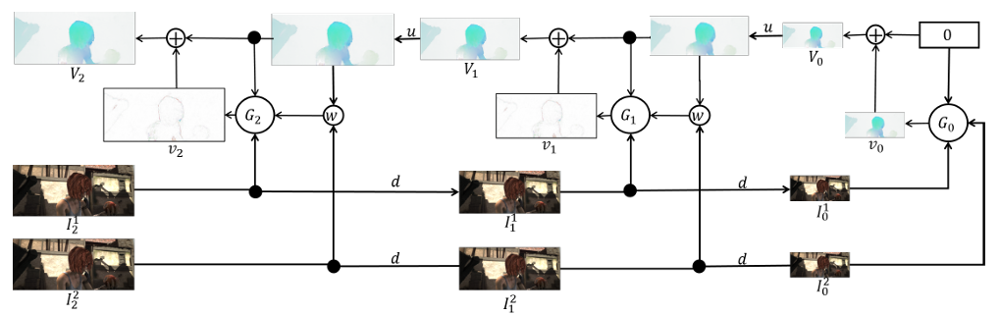 | [GitHub](https://github.com/anuragranj/spynet)   [Paper](https://arxiv.org/abs/1611.00850) |

#### Practical Strategies

##### Iterative Refinement
129 121 122 123 130 102 95 96 41
| Title & Authors | Introduction | Links |
| ------------- | ------------- | ------------- |
| [Siamese Cascaded Region Proposal Networks for Real-Time Visual Tracking](https://arxiv.org/abs/1812.06148)   Heng Fan, Haibin Ling | 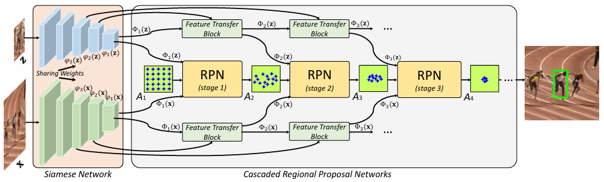 | [Paper](https://arxiv.org/abs/1812.06148) |
| [ATOM: Accurate Tracking by Overlap Maximization](https://arxiv.org/abs/1811.07628)   Martin Danelljan, Goutam Bhat, Fahad Shahbaz Khan, Michael Felsberg |  | [GitHub](https://github.com/visionml/pytracking)   [Paper](https://arxiv.org/abs/1811.07628) |
| [Learning Discriminative Model Prediction for Tracking](https://arxiv.org/abs/1904.07220)   Goutam Bhat, Martin Danelljan, Luc Van Gool, Radu Timofte |  | [GitHub](https://github.com/visionml/pytracking)   [Paper](https://arxiv.org/abs/1904.07220) |
| [Probabilistic Regression for Visual Tracking](https://arxiv.org/abs/2003.12565)   Martin Danelljan, Luc Van Gool, Radu Timofte |  | [GitHub](https://github.com/visionml/pytracking)   [Paper](https://arxiv.org/abs/2003.12565) |
| [Temporal Coherent Object Flow for Multi-Object Tracking](https://ojs.aaai.org/index.php/AAAI/article/view/32749#:~:text=In%20this%20study%2C%20we%20propose%20a%20section-based%20multi-object,the%20basic%20processing%20unit%2C%20denoted%20as%20a%20%E2%80%9Csection%E2%80%9D.)   Zikai Song, Run Luo, Lintao Ma, Ying Tang, Yi-Ping Phoebe Chen, Junqing Yu, Wei Yang | 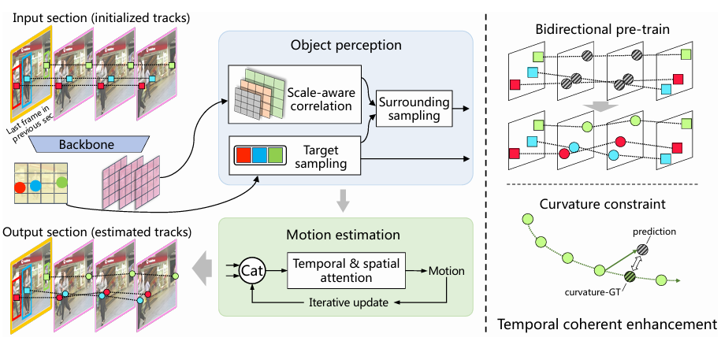 | [Paper](https://ojs.aaai.org/index.php/AAAI/article/view/32749#:~:text=In%20this%20study%2C%20we%20propose%20a%20section-based%20multi-object,the%20basic%20processing%20unit%2C%20denoted%20as%20a%20%E2%80%9Csection%E2%80%9D.) |
| [MixFormer: End-to-End Tracking with Iterative Mixed Attention](https://arxiv.org/abs/2203.11082)   Yutao Cui, Cheng Jiang, Limin Wang, Gangshan Wu |  | [GitHub](https://github.com/MCG-NJU/MixFormer)   [Paper](https://arxiv.org/abs/2203.11082) |
| [PWC-Net: CNNs for Optical Flow Using Pyramid, Warping, and Cost Volume](https://arxiv.org/abs/1709.02371)   Deqing Sun, Xiaodong Yang, Ming-Yu Liu, Jan Kautz |  | [GitHub](https://github.com/NVlabs/PWC-Net)   [Paper](https://arxiv.org/abs/1709.02371) |
| [LiteFlowNet: A Lightweight Convolutional Neural Network for Optical Flow Estimation](https://arxiv.org/abs/1805.07036)   Tak-Wai Hui, Xiaoou Tang, Chen Change Loy |  | [GitHub](https://github.com/twhui/LiteFlowNet)   [Paper](https://arxiv.org/abs/1805.07036) |
| [RAFT: Recurrent All-Pairs Field Transforms for Optical Flow](https://arxiv.org/abs/2003.12039)   Zachary Teed, Jia Deng |  | [GitHub](https://github.com/princeton-vl/RAFT)   [Paper](https://arxiv.org/abs/2003.12039) |

##### Memory Augmentation
131 132 37 133 98 112 106 105 134 135 136 129 121 122 123 130 102 95 96 41
| Title & Authors | Introduction | Links |
| ------------- | ------------- | ------------- |
| [High-Performance Long-Term Tracking with Meta-Updater](https://arxiv.org/abs/2004.00305)   Kenan Dai, Yunhua Zhang, Dong Wang, Jianhua Li, Huchuan Lu, Xiaoyun Yang | 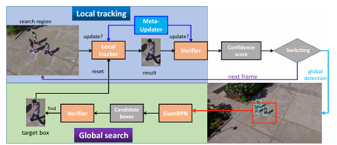 | [GitHub](https://github.com/Daikenan/LTMU)   [Paper](https://arxiv.org/abs/2004.00305) |
| [Long-Term Visual Object Tracking via Continual Learning](https://ieeexplore.ieee.org/document/8935200)   Hui Zhang; Mu Zhu; Jing Zhang; Li Zhuo | 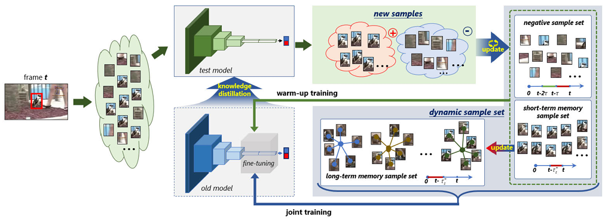 | [Paper](https://ieeexplore.ieee.org/document/8935200) |
| [Attention-Driven Memory Network for Online Visual Tracking](https://ieeexplore.ieee.org/document/10215054)   Huanlong Zhang; Jiamei Liang; Jiapeng Zhang; Tianzhu Zhang; Yingzi Lin; Yanfeng Wang |  | [Paper](https://ieeexplore.ieee.org/document/10215054) |
| [Robust Tracking via Fully Exploring Background Prior Knowledge](https://ieeexplore.ieee.org/abstract/document/10280131)   Zheng’ao Wang; Zikun Zhou; Fanglin Chen; Jun Xu; Wenjie Pei; Guangming Lu | 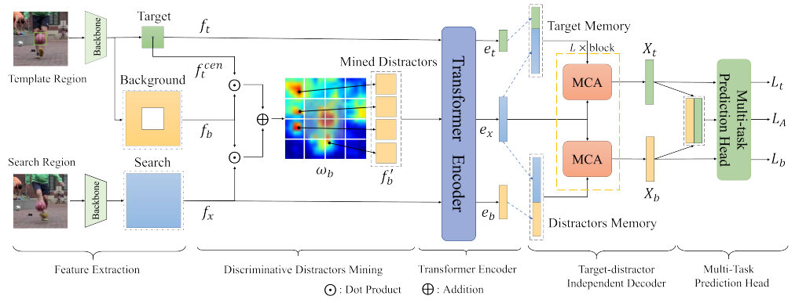 | [Paper](https://ieeexplore.ieee.org/abstract/document/10280131) |
| [Learning Spatio-Temporal Transformer for Visual Tracking](https://arxiv.org/abs/2103.17154)   Bin Yan, Houwen Peng, Jianlong Fu, Dong Wang, Huchuan Lu |  | [GitHub](https://github.com/researchmm/Stark)   [Paper](https://arxiv.org/abs/2103.17154) |
| [Transforming Model Prediction for Tracking](https://arxiv.org/abs/2203.11192)   Christoph Mayer, Martin Danelljan, Goutam Bhat, Matthieu Paul, Danda Pani Paudel, Fisher Yu, Luc Van Gool |  | [GitHub](https://github.com/visionml/pytracking)   [Paper](https://arxiv.org/abs/2203.11192) |
| [VideoTrack: Learning to Track Objects via Video Transformer](https://ieeexplore.ieee.org/document/10204143)   Fei Xie; Lei Chu; Jiahao Li; Yan Lu; Chao Ma |  | [Paper](https://ieeexplore.ieee.org/document/10204143) |
| [ProContEXT: Exploring Progressive Context Transformer for Tracking](https://arxiv.org/abs/2210.15511)   Jin-Peng Lan, Zhi-Qi Cheng, Jun-Yan He, Chenyang Li, Bin Luo, Xu Bao, Wangmeng Xiang, Yifeng Geng, Xuansong Xie |  | [GitHub](https://github.com/jp-lan/ProContEXT)   [Paper](https://arxiv.org/abs/2210.15511) |
| [MeMOT: Multi-Object Tracking with Memory](https://arxiv.org/abs/2203.16761)   Jiarui Cai, Mingze Xu, Wei Li, Yuanjun Xiong, Wei Xia, Zhuowen Tu, Stefano Soatto | 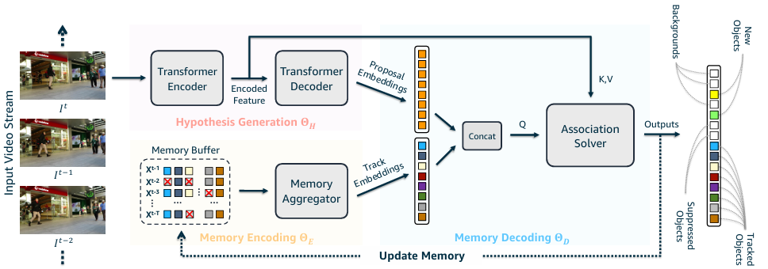 | [Paper](https://arxiv.org/abs/2203.16761) |
| [MeMOTR: Long-Term Memory-Augmented Transformer for Multi-Object Tracking](https://arxiv.org/abs/2307.15700)   Ruopeng Gao, Limin Wang | 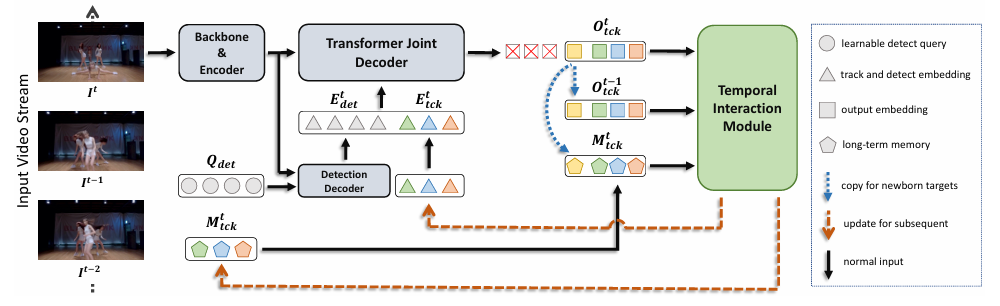 | [GitHub](https://github.com/MCG-NJU/MeMOTR)   [Paper](https://arxiv.org/abs/2307.15700) |
| [MemFlow: Optical Flow Estimation and Prediction with Memory](https://arxiv.org/abs/2404.04808)   Qiaole Dong, Yanwei Fu | 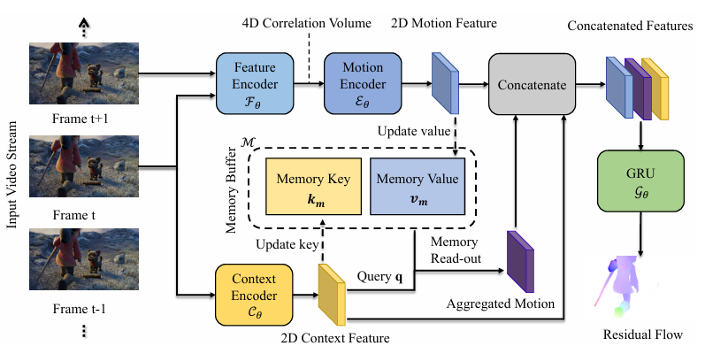 | [GitHub](https://dqiaole.github.io/MemFlow/)   [Paper](https://arxiv.org/abs/2404.04808) |
| [Siamese Cascaded Region Proposal Networks for Real-Time Visual Tracking](https://arxiv.org/abs/1812.06148)   Heng Fan, Haibin Ling |  | [Paper](https://arxiv.org/abs/1812.06148) |
| [ATOM: Accurate Tracking by Overlap Maximization](https://arxiv.org/abs/1811.07628)   Martin Danelljan, Goutam Bhat, Fahad Shahbaz Khan, Michael Felsberg |  | [GitHub](https://github.com/visionml/pytracking)   [Paper](https://arxiv.org/abs/1811.07628) |
| [Learning Discriminative Model Prediction for Tracking](https://arxiv.org/abs/1904.07220)   Goutam Bhat, Martin Danelljan, Luc Van Gool, Radu Timofte |  | [GitHub](https://github.com/visionml/pytracking)   [Paper](https://arxiv.org/abs/1904.07220) |
| [Probabilistic Regression for Visual Tracking](https://arxiv.org/abs/2003.12565)   Martin Danelljan, Luc Van Gool, Radu Timofte |  | [GitHub](https://github.com/visionml/pytracking)   [Paper](https://arxiv.org/abs/2003.12565) |
| [Temporal Coherent Object Flow for Multi-Object Tracking](https://ojs.aaai.org/index.php/AAAI/article/view/32749#:~:text=In%20this%20study%2C%20we%20propose%20a%20section-based%20multi-object,the%20basic%20processing%20unit%2C%20denoted%20as%20a%20%E2%80%9Csection%E2%80%9D.)   Zikai Song, Run Luo, Lintao Ma, Ying Tang, Yi-Ping Phoebe Chen, Junqing Yu, Wei Yang |  | [Paper](https://ojs.aaai.org/index.php/AAAI/article/view/32749#:~:text=In%20this%20study%2C%20we%20propose%20a%20section-based%20multi-object,the%20basic%20processing%20unit%2C%20denoted%20as%20a%20%E2%80%9Csection%E2%80%9D.) |
| [MixFormer: End-to-End Tracking with Iterative Mixed Attention](https://arxiv.org/abs/2203.11082)   Yutao Cui, Cheng Jiang, Limin Wang, Gangshan Wu |  | [GitHub](https://github.com/MCG-NJU/MixFormer)   [Paper](https://arxiv.org/abs/2203.11082) |
| [PWC-Net: CNNs for Optical Flow Using Pyramid, Warping, and Cost Volume](https://arxiv.org/abs/1709.02371)   Deqing Sun, Xiaodong Yang, Ming-Yu Liu, Jan Kautz |  | [GitHub](https://github.com/NVlabs/PWC-Net)   [Paper](https://arxiv.org/abs/1709.02371) |
| [LiteFlowNet: A Lightweight Convolutional Neural Network for Optical Flow Estimation](https://arxiv.org/abs/1805.07036)   Tak-Wai Hui, Xiaoou Tang, Chen Change Loy |  | [GitHub](https://github.com/twhui/LiteFlowNet)   [Paper](https://arxiv.org/abs/1805.07036) |
| [RAFT: Recurrent All-Pairs Field Transforms for Optical Flow](https://arxiv.org/abs/2003.12039)   Zachary Teed, Jia Deng |  | [GitHub](https://github.com/princeton-vl/RAFT)   [Paper](https://arxiv.org/abs/2003.12039) |

##### Online Update
64 65 118 137 121 122 123 138 139 140 141 98 99 112
| Title & Authors | Introduction | Links |
| ------------- | ------------- | ------------- |
| [Visual object tracking using adaptive correlation filters](https://webvpn.whut.edu.cn/https/77726476706e69737468656265737421f9f244993f20645f6c0dc7a59d50267b1ab4a9/document/5539960)   David S. Bolme; J. Ross Beveridge; Bruce A. Draper; Yui Man Lui |  | [Paper](https://webvpn.whut.edu.cn/https/77726476706e69737468656265737421f9f244993f20645f6c0dc7a59d50267b1ab4a9/document/5539960) |
| [High-Speed Tracking with Kernelized Correlation Filters](https://arxiv.org/abs/1404.7584)   João F. Henriques, Rui Caseiro, Pedro Martins, Jorge Batista |  | [Paper](https://arxiv.org/abs/1404.7584) |
| [Learning Multi-Domain Convolutional Neural Networks for Visual Tracking](https://arxiv.org/abs/1510.07945)   Hyeonseob Nam, Bohyung Han |  | [Paper](https://arxiv.org/abs/1510.07945) |
| [Learning to Track with Object Permanence](https://arxiv.org/abs/2103.14258)   Pavel Tokmakov, Jie Li, Wolfram Burgard, Adrien Gaidon | 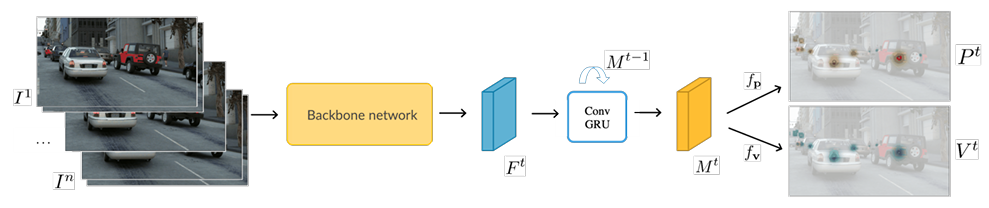 | [Paper](https://arxiv.org/abs/2103.14258) |
| [Meta-Tracker: Fast and Robust Online Adaptation for Visual Object Trackers](https://arxiv.org/abs/1801.03049)   Eunbyung Park, Alexander C. Berg | 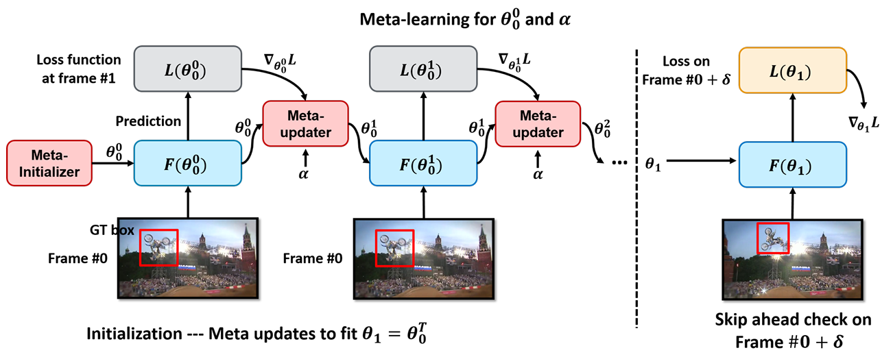 | [GitHub](https://github.com/silverbottlep/meta_trackers)   [Paper](https://arxiv.org/abs/1801.03049) |
| [CLNet: A Compact Latent Network for Fast Adjusting Siamese Trackers](https://link.springer.com/chapter/10.1007/978-3-030-58565-5_23)   Xingping Dong, Jianbing Shen, Ling Shao & Fatih Porikli | 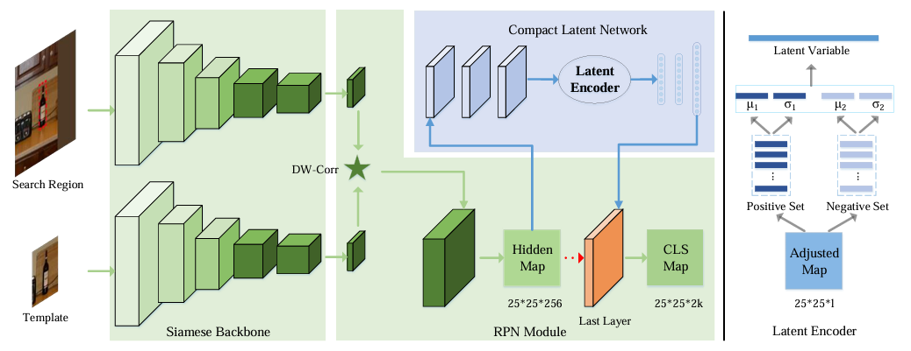 | [GitHub](https://github.com/xingpingdong/CLNet-tracking)   [Paper](https://link.springer.com/chapter/10.1007/978-3-030-58565-5_23) |
| [Meta-Graph Adaptation for Visual Object Tracking](https://ieeexplore.ieee.org/document/9428441)   Qiangqiang Wu; Antoni B. Chan | 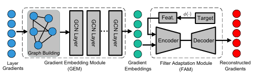 | [Paper](https://ieeexplore.ieee.org/document/9428441) |
| [Robust Visual Tracking by Segmentation](https://arxiv.org/abs/2203.11191)   Matthieu Paul, Martin Danelljan, Christoph Mayer, Luc Van Gool | 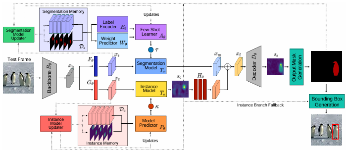 | [GitHub](https://github.com/visionml/pytracking)   [Paper](https://arxiv.org/abs/2203.11191) |
| [Learning Spatio-Temporal Transformer for Visual Tracking](https://arxiv.org/abs/2103.17154)   Bin Yan, Houwen Peng, Jianlong Fu, Dong Wang, Huchuan Lu |  | [GitHub](https://github.com/researchmm/Stark)   [Paper](https://arxiv.org/abs/2103.17154) |
| [Transformer Meets Tracker: Exploiting Temporal Context for Robust Visual Tracking](https://arxiv.org/abs/2103.11681)   Ning Wang, Wengang Zhou, Jie Wang, Houqaing Li |  | [GitHub](https://github.com/594422814/TransformerTrack)   [Paper](https://arxiv.org/abs/2103.11681) |
| [Transforming Model Prediction for Tracking](https://arxiv.org/abs/2203.11192)   Christoph Mayer, Martin Danelljan, Goutam Bhat, Matthieu Paul, Danda Pani Paudel, Fisher Yu, Luc Van Gool |  | [GitHub](https://github.com/visionml/pytracking)   [Paper](https://arxiv.org/abs/2203.11192) |

### Motion Understanding

#### Motion-Separated Modeling

##### Intra-Block Separated Modeling

##### Parallel Inter-Block Separated Modeling

##### Sequential Inter-Block Separated Modeling

#### Motion-Joint Modeling

##### Local Operator

##### Global Interaction

##### Local-Global Mechanism

##### LLM-based Modeling

#### Context-Augmented Modeling

##### Multimodal Fusion

##### Cross-Modal Alignment

##### Contextual Priors

### Motion Generation

#### Explicit Motion Guidance

##### Input-level Embedding

##### Latent-level Fusion

##### Architecture-Level Integration

#### Implicit Motion Learning

##### Input-level Preparation

##### Architectural-level Refinement

##### Training Optimization

#### Practical Strategies

##### Dynamic Condition

##### Frequency decomposition

##### Extract motion representation

##### Autoregressive Generation

## Acknowledgement

## Citation
